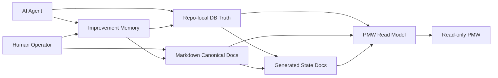

# Harness Full Design Review

## 1. Purpose
이 문서는 현재 하네스 구현 방향을 다른 모델이나 리뷰어가 한 번에 검토할 수 있도록 만든 단일 설계 패킷이다. 요구사항, 아키텍처, 구현 순서, UI 원칙, 품질/보안 절차, 그리고 이번 변경사항을 한 문서에 통합한다.

현재 workspace는 기존 prototype 코드를 복사해 이어가는 저장소가 아니라, 검증된 계약만 가져와 문서 기준선부터 다시 세우는 greenfield thin workspace다. 따라서 이 문서의 핵심 목적은 "무엇을 만들지"와 "어떤 순서로 승인하고 구현할지"를 먼저 닫는 것이다.

## 2. What Changed In This Revision
1. `REQUIREMENTS.md` 작성은 구현 이슈가 닫힐 때까지 deep interview를 진행하는 것으로 명시했다.
2. `Project Goal`은 추진목적, 기대효과, 최종사용자를 분리해 사용자 친화적으로 읽히도록 재정의했다.
3. `REQUIREMENTS.md`가 사용자 최종 확정된 이후에만 `ARCHITECTURE_GUIDE.md`, `IMPLEMENTATION_PLAN.md`, `UI_DESIGN.md`를 기준선으로 작성하거나 sync하도록 게이트를 명시했다.
4. 디자인 목업은 보기 좋은 그림이 아니라 실제 구현 로직, source-to-surface mapping, 상태 전이, read-only 경계를 반영하는 설계 입력물로 정의했다.
5. 하네스 운영 중 발견한 비효율을 기록하고, 반복되면 개선 과제로 승격하는 self-improvement loop를 설계에 포함했다.
6. AI가 반복적으로 이해해야 하는 운영 상태와 유지보수 신호는 DB에 구조화하고, 사람이 읽고 승인해야 하는 맥락은 Markdown canonical docs로 남기는 방향을 명확히 했다.
7. 개발 작업 단위가 끝날 때마다 refactor checkpoint를 수행하는 품질 절차를 포함했다.
8. 코드, 스크립트, dependency, cutover를 포함한 security review process를 release gate에 포함했다.
9. 하네스 전반의 결정 요청 문서와 decision surface는 `최대한 쉽게 + 충분한 근거` 원칙을 따르도록 명시했다.
10. 초기 rough baseline 승인과 작업 단위 상세 승인 사이를 분리하고, 사용자가 직접 체감하는 `프로그램 기능과 UI/UX` 구현은 task-level planning/design sync 후에만 진행하도록 명시했다.
11. PLN-00 승인 결과에 맞춰 first-ship DB, validator, artifact viewer, security automation 기준선을 downstream 문서에 sync하고 `PKT-01_WORK_ITEM_PACKET_TEMPLATE.md`를 추가했다.

## 3. Product Definition

### 추진목적
1. 프로젝트 운영 상태를 한 번의 수정으로 일관되게 유지할 수 있게 만든다.
2. 최종사용자가 PMW 첫 화면과 연결된 아티팩트만으로 현재 판단 지점을 빠르게 읽게 만든다.
3. 하네스가 스스로 운영 비효율을 기록하고 개선할 수 있게 만든다.
4. AI와 사람이 각자 이해하기 쉬운 truth surface를 분리해 유지 비용을 줄인다.

### 기대효과
1. 상태 변경 시 여러 문서를 중복 수정하는 비용을 줄인다.
2. PMW가 단순 대시보드가 아니라 실제 운영 reading desk 역할을 하게 만든다.
3. AI는 구조화된 상태와 리뷰 로그를 빠르게 복원하고, 사람은 승인 가능한 Markdown 문서를 중심으로 판단한다.
4. 리팩터링과 보안 점검이 개발 종료 후 별도 이벤트가 아니라 상시 품질 루프로 들어오게 만든다.

### 최종사용자
- 현재 무엇을 결정해야 하는지 빠르게 읽어야 하는 사용자
- 하네스를 유지·개선하는 AI 에이전트
- 승인, 리뷰, 운영 맥락을 관리하는 사람 운영자

## 3A. Core Operating Principles

### 1. 맥락 유지
- 하네스는 세션, 턴, 역할, 담당 모델이 바뀌어도 현재 상태와 판단 근거를 빠르게 복원할 수 있어야 한다.
- hot-state, handoff, generated docs, PMW detail, source trace는 모두 context restoration을 돕는 방향으로 설계한다.
- 요약은 짧게 보이더라도 근거 없는 압축이 되면 안 되며, 항상 source trace나 canonical context로 다시 내려갈 수 있어야 한다.

### 2. SOP 준수
- 승인된 workflow, gate, validation rule, cutover order는 단순 참고가 아니라 하네스 운영 계약이다.
- SOP는 문서, 스크립트, validator, UI behavior가 같은 기준을 가리키도록 유지한다.
- 예외가 필요하면 묵시적으로 우회하지 않고 change request, exception record, follow-up owner를 남긴다.

### 3. Human In The Loop
- 하네스는 자동화와 self-improvement를 지향하지만, 핵심 결정은 사람이 확인하는 구조를 유지한다.
- requirements freeze, architecture baseline sync, mockup approval, security risk acceptance, release/cutover는 명시적인 human approval point다.
- 사람이 이해할 수 있는 Markdown canonical docs와 explainable PMW surface를 유지하는 이유도 이 원칙 때문이다.

### 4. Decision-Ready Authoring
- 하네스는 사용자가 raw trade-off를 다시 해석해서 결론을 조합하게 만들지 않는다.
- 결정 요청 문서는 가능한 한 바로 `approve`, `adjust`, `defer`를 고를 수 있어야 한다.
- 따라서 권장 결론, 핵심 근거, 예외 조건, fallback 규칙을 함께 보여 주는 것을 기본 형식으로 삼는다.
- PMW decision surface도 같은 원칙을 따라, 짧게 읽히더라도 왜 그 결론이 나왔는지 source trace로 다시 내려갈 수 있어야 한다.

### 5. Progressive Elaboration And Approval
- 최초 requirements, architecture, implementation plan, UI design은 rough baseline일 수밖에 없다.
- 하지만 rough baseline은 구현 방향을 승인하는 것이지, 각 작업의 최종 behavior와 화면 detail을 자동 승인하는 것이 아니다.
- 따라서 실제 구현은 work item별 task-level packet으로 목표, 상세 동작, 화면/상태 변화, edge case, acceptance를 다시 닫은 뒤에 시작한다.
- 사용자가 직접 체감하는 `프로그램 기능과 UI/UX`는 human sync 또는 approval 없이 코드에서 먼저 확정하지 않는다.
- 구현 중 detail이 새로 생기면 코드에서 흡수하지 말고 packet을 다시 열어 협의한 뒤 진행한다.

### Why These Five Principles Matter In Practice
- 맥락 유지가 절차로 내려가지 않으면 세션 전환 때마다 AI와 사람이 서로 다른 상태를 읽게 된다.
- SOP 준수가 drift detection과 recovery rule로 연결되지 않으면 운영 계약은 문구로만 남는다.
- human in the loop가 promotion과 cutover 절차에 연결되지 않으면 self-improvement와 automation이 통제 경계를 넘는다.
- decision-ready authoring이 빠지면 사용자는 결정을 내리기 전에 문서 구조와 trade-off를 다시 조립해야 하므로 승인 속도와 정확도가 떨어진다.
- progressive elaboration이 빠지면 rough 방향 문서와 실제 구현 사이가 벌어지고, user-facing 결과물이 승인 없이 코드에서 먼저 결정되어 롤백 비용이 커진다.

## 4. System Shape

### Layer Summary
- Repo-local DB truth: hot-state와 AI가 빠르게 읽어야 하는 운영 메타데이터의 단일 write surface
- Markdown canonical docs: 목표, 승인, 설계 의도, 리뷰 판단 근거를 사람이 읽고 승인할 수 있는 정본
- Generated state docs: DB와 canonical docs를 바탕으로 생성되는 projection 문서
- PMW read model: strong surface와 detail, artifact viewer를 조립하는 읽기 전용 모델
- Improvement memory: 운영 중 비효율, 반복 friction, refactor/security 결과를 누적하고 개선 과제로 승격하는 메모리

### Principle Mapping
- 맥락 유지는 DB truth, Markdown canonical docs, generated docs, handoff, source trace가 함께 보장한다.
- SOP 준수는 workflow gate, validator, cutover sequence, approval flow가 함께 보장한다.
- human in the loop는 Markdown approval, mockup review, release gate, security gate가 함께 보장한다.

## 4A. Context Restoration Flow
1. release state와 freshness metadata를 먼저 읽어 현재 stage와 stale 여부를 판단한다.
2. open decisions, blockers/risks, next action을 읽어 현재 판단 지점을 조립한다.
3. 최근 handoff와 designated summary를 읽어 역할 전환과 최근 맥락을 복원한다.
4. 각 strong surface는 source trace를 통해 canonical context나 artifact로 다시 내려갈 수 있어야 한다.
5. checksum 또는 freshness mismatch가 있으면 stale 상태를 표기하고, human confirmation 전까지 cutover를 막는다.

## 4B. Drift Handling Between DB And Markdown
- validator는 DB truth, generated docs, designated summary 간 mismatch를 감지한다.
- drift가 감지되면 시스템은 silent sync를 하지 않고 stale 상태와 recovery action을 노출한다.
- recovery path는 `re-generate -> re-validate -> human confirm` 또는 `rollback to last known good snapshot`이다.
- unresolved drift는 release/cutover blocker다.

## 5. Ownership Split

| 영역 | 기본 소유권 | 왜 그렇게 두는가 |
|---|---|---|
| Hot-state | repo-local DB | 자주 바뀌며 AI가 구조적으로 읽어야 하기 때문 |
| Approval / rationale / human context | Markdown | 사람이 diff와 문맥을 보고 승인해야 하기 때문 |
| Generated state docs | generator output | 직접 편집보다 projection consistency가 중요하기 때문 |
| PMW surface data | DB + designated Markdown summary | strong surface에 raw prose leakage를 막기 위해 |
| Improvement records | DB structured log + Markdown summary | AI retrieval과 human review를 동시에 만족시키기 위해 |

### Practical Rule
- "자주 바뀌고 AI가 반복 조회하는 정보"는 DB 쪽으로 보낸다.
- "사람이 의미와 근거를 읽고 승인해야 하는 정보"는 Markdown에 남긴다.
- 같은 정보를 두 곳에 동시에 직접 수정하지 않는다.

## 6. Proposed Minimal First-Ship Data Model
아래는 first ship 기준의 제안 스키마다. 정확한 테이블 분할은 requirements freeze 이후 architecture sync 단계에서 최종 확정한다.

| Entity | 목적 |
|---|---|
| `release_state` | 현재 stage, goal, focus, gate state 관리 |
| `work_item_registry` | 작업 상태, 다음 행동, source reference 관리 |
| `decision_registry` | 결정 필요 항목과 impact 관리 |
| `gate_risk_registry` | blocker, risk, severity, escalation 관리 |
| `handoff_log` | append-only handoff chain 관리 |
| `artifact_index` | PMW artifact viewer와 source trace 연결 |
| `generation_state` | generated docs checksum, parity, run metadata 관리 |

### Deferred From Core Schema
- `project_registry`: current workspace가 single-project thin workspace이므로 후속 packet으로 미룬다.
- dedicated `improvement_log`: first ship에서는 existing DB-backed operational record와 대응 문서로 운영하고, dedicated log는 후속 packet에서 분리 여부를 다시 본다.
- dedicated `quality_review_log`: first ship에서는 대응 문서 또는 existing operational record에 남기고, dedicated log 분리는 후속 packet에서 다시 본다.

### Data Modeling Rules
- 모든 mutable row는 optimistic concurrency를 고려한다.
- `source_ref`는 repo-relative path 기반 규칙으로 고정한다.
- handoff는 append-only로 유지한다.
- generated output은 checksum과 run metadata를 남긴다.
- improvement / quality review는 dedicated log를 추가하더라도 DB-backed operational capture와 사람이 읽는 요약을 함께 유지한다.

## 7. Canonical Document Set

| 문서 | 역할 |
|---|---|
| `REQUIREMENTS.md` | 가장 사용자 친화적인 기준 문서, 목표와 승인 기준의 시작점 |
| `ARCHITECTURE_GUIDE.md` | truth ownership, layer boundaries, forbidden path 정의 |
| `IMPLEMENTATION_PLAN.md` | 구현 순서, gate, task packet, validation rule 정의 |
| `UI_DESIGN.md` | PMW 정보구조, mockup contract, source-to-surface rule 정의 |
| `PROTOTYPE_REFERENCE.md` | prototype에서 carry-forward 할 계약과 버릴 요소 정리 |
| `HARNESS_FULL_DESIGN_REVIEW.md` | 외부 모델/리뷰어를 위한 단일 검토 패킷 |

### Authoring Workflow
1. deep interview로 구현 핵심 이슈를 닫는다.
2. `REQUIREMENTS.md`를 사용자 친화적으로 정리하고 최종 확정을 받는다.
3. 그 다음에만 architecture / implementation / UI 문서를 같은 기준선으로 sync한다.
4. rough mockup은 실제 source-to-surface mapping과 상태 전이를 반영한 뒤 승인한다.
5. 각 구현 작업은 `PKT-01_WORK_ITEM_PACKET_TEMPLATE.md`를 사용해 task-level planning/design packet으로 다시 구체화하고 필요한 human sync를 거친다.
6. 구현 중 requirements나 user-facing detail이 바뀌면 change request 또는 packet resync로 다시 닫고 진행한다.

### Why This Workflow Exists
- 맥락 유지를 위해 기준 문서의 순서를 고정한다.
- SOP 준수를 위해 requirements 승인 전 downstream baseline을 열지 않는다.
- human in the loop를 위해 핵심 freeze와 approval point를 문서상으로 먼저 닫는다.

## 7A. Self-Improvement Promotion Procedure
1. AI는 friction 또는 반복 비효율을 improvement candidate로 기록한다.
2. candidate는 baseline 변경이 아니라 review queue로만 올라간다.
3. human reviewer가 `discard`, `backlog`, `change request` 중 하나로 분류한다.
4. `change request`로 승인된 경우에만 requirements/architecture/implementation baseline 변경을 연다.
5. 승인되지 않은 candidate는 참고 기록으로만 남고 시스템 행동을 바꾸지 않는다.

## 8. PMW Product Design
PMW는 dashboard가 아니라 reading desk다. 첫 화면은 "무엇을 결정해야 하는지", "무엇이 막고 있는지", "현재 무엇을 하고 있는지", "다음에 무엇을 해야 하는지"를 먼저 읽게 만들어야 한다.

### First-Ship Surfaces
- Hero / Product Goal
- Decision Required
- Blocked / At Risk
- Current Focus
- Next Action
- Active Detail Panel
- Artifact Viewer
- Settings

### Artifact Viewer Mandatory Scope
- canonical docs
- generated docs
- latest handoff

### Intended Source-To-Surface Mapping
| Surface | Primary Source |
|---|---|
| Hero / Product Goal | `REQUIREMENTS.md` |
| Decision Required | `CURRENT_STATE.md` designated summary or equivalent read model |
| Blocked / At Risk | `TASK_LIST.md` designated summary or equivalent read model |
| Current Focus | `CURRENT_STATE.md` designated summary or equivalent read model |
| Next Action | `IMPLEMENTATION_PLAN.md` designated operator section |

### PMW Rules
- strong surface는 short summary만 노출한다.
- detail panel은 full list, impact, related artifact, source trace를 보여 준다.
- artifact viewer는 읽기 품질을 우선하고 write action은 제공하지 않는다.
- count badge는 visible detail list와 1:1이어야 한다.
- diagnostics는 secondary layer에 두고 blocking일 때만 강하게 올린다.
- raw technical prose를 strong surface에 직접 투영하지 않는다.
- decision surface는 사용자가 raw trade-off를 다시 조합하지 않게, 권장 판단과 근거를 짧게 읽히도록 구성한다.
- 사용자는 PMW에서 지금 상태를 빠르게 읽되, 필요하면 source trace를 통해 canonical context로 내려갈 수 있어야 한다.
- freshness issue가 있으면 PMW는 이를 읽을 수 있게 표시하되, non-blocking diagnostics와 strong surface hierarchy를 깨지 않는 방식으로 다룬다.
- rough design에서 비어 있던 user-facing detail을 구현 단계에서 임의로 확정하지 않는다.

## 9. Mockup Contract
디자인 목업은 구현 계약을 시각화한 문서여야 한다. 아래 조건을 충족하지 못하면 승인 가능한 mockup으로 보지 않는다.

1. 각 카드와 패널이 실제 데이터 source 또는 read model field에 매핑되어야 한다.
2. empty, loading, error, diagnostics, source trace 상태가 구현 관점에서 설명되어야 한다.
3. read-only boundary가 화면과 설명에서 명확해야 한다.
4. placeholder interaction만 있는 화면은 허용하지 않는다.
5. design review는 색/레이아웃뿐 아니라 source-to-surface mapping과 상태 전이를 함께 검토한다.
6. rough mockup 승인 뒤에도 사용자가 직접 체감하는 `프로그램 기능과 UI/UX` work item은 task-level detailed design과 human sync를 다시 거쳐야 한다.

## 10. Self-Improvement Loop
하네스는 스스로를 유지·개선할 수 있어야 한다. 이를 위해 운영 중 생기는 비효율을 ad-hoc 메모로 흘려보내지 않고 구조화된 루프로 다룬다.

### Capture
- planning, dev, test, review, deploy, handoff 단계에서 friction을 기록한다.
- friction은 first ship에서는 existing DB-backed operational record와 사람이 읽는 요약으로 남기고, dedicated `improvement_log` 분리는 후속 packet에서 재평가한다.

### Promotion
- 같은 유형의 friction이 반복되면 개선 후보로 묶는다.
- 개선 후보는 human review를 거친 경우에만 requirements 또는 architecture 수준 change request로 승격한다.

### Execution
- 승인된 개선만 baseline 문서와 구현으로 반영한다.
- non-blocking hygiene와 acceptance-critical 개선을 구분한다.

## 11. Quality And Security Process

### Refactor Policy
- 각 개발 작업 단위가 끝날 때마다 refactor checkpoint를 수행한다.
- refactor는 "나중에 한 번"이 아니라 task close 정의에 포함한다.
- 리팩터링 결과와 미루는 이유를 대응 문서 또는 existing operational record에 기록하고, dedicated `quality_review_log` 분리는 후속 packet에서 재평가한다.

### Security Review Scope
- 코드 경로와 입력 처리
- 스크립트 실행 경로와 shell/file/path operation
- dependency 추가 및 변경
- secret handling
- generated docs integrity
- validator / migration / cutover 절차

### Security Gate
- first ship 자동화는 path/file operation, dependency inventory, secret scan, cutover rollback presence preflight까지만 포함한다.
- critical security finding이 남아 있으면 release / cutover를 열지 않는다.
- high severity finding은 명시적 승인 없이는 defer하지 않는다.
- security exception은 human in the loop 원칙에 따라 승인 기록 없이 통과시키지 않는다.

## 12. Delivery Lanes

### Lane A: UI Read Model
- PMW 4-surface
- detail panel
- artifact viewer
- settings

### Lane B: State Infrastructure
- DB schema and store
- generated docs
- validator
- migration / cutover
- operational review/security records and deferred dedicated logs

### Lane C: Rollout
- starter promotion
- downstream sync
- self-hosting adoption

### Lane Rule
- Lane A와 Lane B를 한 iteration에서 과도하게 결합하지 않는다.
- UI fix lane과 cutover lane이 같이 묶이면 둘 다 막힐 수 있으므로 release gate 직전까지 분리한다.

## 13. Implementation Sequence
1. Deep interview until implementation-critical issues are closed.
2. User-friendly requirements freeze.
3. Post-approval architecture / implementation / UI sync.
4. Rough mockup approval.
5. Per-work-item planning and detailed design approval.
6. DB foundation.
7. Generated state docs and drift validator.
8. Context restoration read model.
9. PMW read surface.
10. Validator / migration / cutover tooling.
11. Per-packet refactor and security review.
12. Review gate and self-hosting decision.

## 14. Acceptance Baseline
- 하네스가 세션 전환 후에도 `release state -> open decisions/risks -> next action -> recent handoff -> source trace` 순서로 핵심 상태와 판단 근거를 복원한다.
- 승인된 SOP와 실제 운영 절차가 일치하고, 예외는 기록된다.
- human approval point가 필요한 단계에서 human in the loop가 유지된다.
- 사용자가 결정을 내려야 하는 문서와 PMW surface는 쉽게 읽히면서도 결론을 뒷받침하는 근거와 fallback을 함께 제공한다.
- rough baseline 문서가 승인되더라도, 각 작업 단위의 상세 기획과 상세 디자인은 별도 human sync 또는 approval을 거친다.
- 사용자가 직접 체감하는 `프로그램 기능과 UI/UX`는 코드 구현이 human agreement보다 앞서가지 않는다.
- requirements 핵심 이슈가 닫히거나 명시적으로 deferred 된다.
- requirements 승인 전 downstream baseline 문서를 열지 않는다.
- generated docs deterministic / parity pass
- 지정 reviewer가 PMW first view만 보고 30초 안에 `무엇을 결정해야 하는지`, `무엇이 막고 있는지`, `다음에 무엇을 해야 하는지` 세 질문에 답할 수 있다.
- summary/detail/source trace/count parity pass
- raw technical prose direct projection 없음
- mockup과 implemented UI가 같은 behavior contract를 공유
- validator가 drift, missing source, mojibake, cutover mismatch를 탐지
- migration preview와 rollback path가 문서, 스크립트, 검증에서 일치
- 각 개발 단위 종료 시 refactor review 기록
- release 전 security review 완료 및 critical finding zero
- improvement candidate는 human review를 거쳐야만 baseline change로 승격된다.

## 15. Non-Blocking Review Questions
1. PMW source-to-surface mapping에서 generated doc 기반과 direct read model 기반의 균형을 어떻게 두는 것이 좋은가
2. mockup approval 단계에서 어떤 evidence를 필수로 요구해야 구현 drift를 가장 잘 줄일 수 있는가
3. self-improvement loop가 과도한 process overhead가 되지 않도록 막는 가장 좋은 guardrail은 무엇인가
