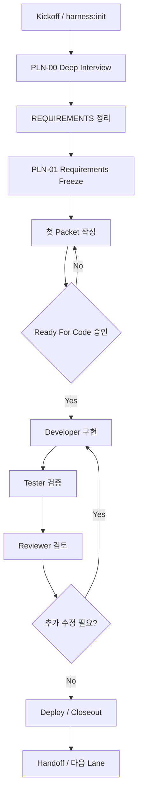
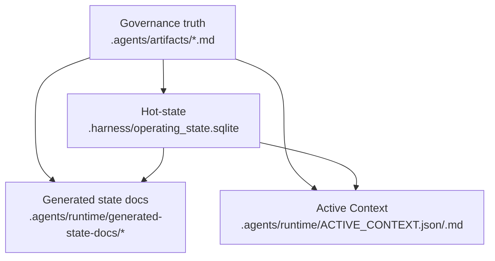

# Standard Harness Manual

이 문서는 설치된 표준 하네스를 운영하는 사람을 위한 primary manual이다.
처음 사용하는 사람은 `START_HERE.md`로 시작하고, 실제 운영 기준과 상세 설명은 이 문서를 기준으로 본다.

## TOC
- [1. 하네스란 무엇인가](#1-하네스란-무엇인가)
- [2. 핵심 용어](#2-핵심-용어)
- [3. 전체 생명주기](#3-전체-생명주기)
- [4. 아티팩트 맵](#4-아티팩트-맵)
- [5. CLI 명령 레퍼런스](#5-cli-명령-레퍼런스)
- [6. Packet Quick Start](#6-packet-quick-start)
- [7. 하루 운영 시나리오](#7-하루-운영-시나리오)
- [8. 설치 후 정상 동작 확인](#8-설치-후-정상-동작-확인)
- [9. 기존 프로젝트에 적용하기](#9-기존-프로젝트에-적용하기)
- [10. 트러블슈팅과 FAQ](#10-트러블슈팅과-faq)

## 1. 하네스란 무엇인가

표준 하네스는 `프로젝트를 어떻게 개발할지`를 통제하는 운영 프레임이다.
코드 생성기나 템플릿만 있는 도구가 아니라, 요구사항 정리, 승인 경계, 구현 단위 packet, handoff, 검증 리포트, 재진입 상태까지 한 흐름으로 묶는 체계다.

사람에게는 `지금 어디까지 왔는지`, `무엇을 결정해야 하는지`, `다음에 무엇을 해야 하는지`를 빠르게 보여 주는 역할을 한다.
AI에게는 `어디를 먼저 읽어야 하는지`, `어떤 문서를 정본으로 따라야 하는지`, `언제 구현을 멈추고 승인을 받아야 하는지`를 강제하는 역할을 한다.

이 하네스의 기본 원칙은 세 가지다.

- 정본과 파생물을 구분한다.
- packet 없이 바로 구현하지 않는다.
- 사람이 승인할 지점과 AI가 실행할 지점을 섞지 않는다.

## 2. 핵심 용어

| 용어 | 뜻 | 예시 |
|---|---|---|
| SSOT | 하나의 사실에 대해 하나의 정본만 둔다는 원칙 | 요구사항 정본은 `.agents/artifacts/REQUIREMENTS.md` |
| Governance truth | 사람이 읽고 승인하는 Markdown 정본 계층 | `.agents/artifacts/*` |
| Hot-state | 하네스가 빠르게 읽는 구조화된 운영 상태 | `.harness/operating_state.sqlite` |
| Generated doc | 정본과 DB를 바탕으로 자동 생성되는 문서 | `.agents/runtime/generated-state-docs/*` |
| Derived doc | 정본이 아니라 재진입과 요약을 위해 파생된 surface | `.agents/runtime/ACTIVE_CONTEXT.*` |
| Packet | 코드 착수 전에 작업 범위와 acceptance를 닫는 작업 단위 문서 | `reference/packets/PKT-01_*.md` |
| Lane | 현재 작업이 속한 실행 경로 또는 역할 흐름 | planner, developer, tester, reviewer |
| Gate | 다음 단계로 넘어가기 전에 충족해야 하는 검증 경계 | `Ready For Code`, packet exit quality gate |
| Profile | 특정 프로젝트 유형에서만 켜는 선택형 규칙 묶음 | `PRF-01`, `PRF-04`, `PRF-09` |
| Active Context | 지금 상태를 빠르게 재진입하기 위한 요약 surface | `.agents/runtime/ACTIVE_CONTEXT.json`, `.md` |
| Handoff | 한 역할에서 다음 역할로 작업을 넘기는 명시적 전환 | `Developer -> Tester` |

## 3. 전체 생명주기

하네스는 아래 순서를 기본값으로 본다.



실전에서는 `Design`, `Deployer`, `Documenter`가 중간에 추가될 수 있다.
하지만 처음 사용자는 아래 네 질문만 먼저 기억하면 된다.

- 지금은 kickoff 전인가, packet 전인가, 구현 중인가, closeout 중인가
- 지금 역할은 planner, developer, tester, reviewer 중 어디에 가까운가
- 다음 단계로 가려면 사람이 승인해야 하는가
- 지금 읽어야 할 정본 문서는 무엇인가

## 4. 아티팩트 맵

### 4.1 정본과 파생물 관계



### 4.2 어떤 문서가 무슨 역할을 하나

| 위치 | 역할 | 언제 먼저 읽나 |
|---|---|---|
| `.agents/artifacts/REQUIREMENTS.md` | 무엇을 만들 것인가 | kickoff, 요구사항 변경 시 |
| `.agents/artifacts/ARCHITECTURE_GUIDE.md` | 어떻게 나눠 설계할 것인가 | requirements 확정 후 |
| `.agents/artifacts/IMPLEMENTATION_PLAN.md` | 어떤 순서로 닫을 것인가 | lane와 packet 순서 확인 시 |
| `.agents/artifacts/CURRENT_STATE.md` | 지금 어디까지 왔는가 | 매일 시작할 때 |
| `.agents/artifacts/TASK_LIST.md` | 현재 열려 있는 작업과 다음 작업 | 매일 시작할 때 |
| `.agents/runtime/ACTIVE_CONTEXT.json` | AI가 빠르게 재진입하는 compact 상태 | AI 재진입 첫 읽기 |
| `.agents/runtime/ACTIVE_CONTEXT.md` | 사람이 빠르게 재진입하는 한국어 요약 | 사람이 상태 요약 볼 때 |
| `reference/planning/*` | 인터뷰, freeze 같은 planning 기준 | kickoff, planning 시 |
| `reference/packets/*` | 작업 단위 packet | 구현 직전과 구현 중 |
| `reference/profiles/*` | 특정 유형 프로젝트용 선택 규칙 | profile을 켤 때 |

정본과 파생물을 헷갈리면 안 된다.

- `.agents/artifacts/*`는 사람이 승인하는 정본이다.
- `.agents/runtime/*`는 재생성 가능한 파생물이다.
- generated surface가 이상하면 generated file을 고치지 말고 정본과 상태를 먼저 맞춘다.

## 5. CLI 명령 레퍼런스

아래 명령은 설치된 프로젝트 루트에서 사용한다.

### `npm run harness:init`
- 목적: 새 프로젝트를 하네스 usable state로 초기화한다.
- 언제 쓰나: starter를 복사한 직후, 또는 빈 프로젝트에 하네스를 막 올린 직후.
- 기대 출력: 프로젝트 이름, 목표, profile 같은 초기 질문을 받고 기본 artifact와 state가 생성된다.
- 실패 시 첫 대응: Node.js 24 이상인지, 현재 위치가 프로젝트 루트인지 확인한다.
- 관련 아티팩트: `.harness/operating_state.sqlite`, `.agents/artifacts/*`, `.agents/runtime/*`

예시:

```text
Project initialized
Active profiles: PRF-07, PRF-09
Next action: Start PLN-00 deep interview
```

### `npm run harness:status`
- 목적: 현재 단계, 현재 focus, 다음 action을 짧게 본다.
- 언제 쓰나: 하루 시작, 중단 후 복귀, handoff 직후.
- 기대 출력: 현재 stage, focus, next action 요약이 나온다.
- 실패 시 첫 대응: `harness:init`이 끝났는지, `CURRENT_STATE.md`와 DB 상태가 비어 있지 않은지 확인한다.
- 관련 아티팩트: `CURRENT_STATE.md`, `ACTIVE_CONTEXT.*`

### `npm run harness:next`
- 목적: 다음 workflow와 구체 next work를 확인한다.
- 언제 쓰나: 지금 뭘 해야 할지 애매할 때.
- 기대 출력: 다음 owner, workflow, next first action이 나온다.
- 실패 시 첫 대응: `TASK_LIST.md`와 최신 handoff가 비어 있지 않은지 확인한다.
- 관련 아티팩트: `TASK_LIST.md`, `ACTIVE_CONTEXT.*`

### `npm run harness:context`
- 목적: AI용 JSON과 사람용 Markdown active context를 생성 또는 갱신한다.
- 언제 쓰나: init 직후, handoff 직후, closeout 직후, stale 의심 시.
- 기대 출력: `ACTIVE_CONTEXT.json`과 `ACTIVE_CONTEXT.md`가 최신 상태로 생성된다.
- 실패 시 첫 대응: `.harness/operating_state.sqlite` 존재 여부와 validator 오류를 먼저 확인한다.
- 관련 아티팩트: `.agents/runtime/ACTIVE_CONTEXT.json`, `.md`

### `npm run harness:doctor`
- 목적: 하네스 운영 상태를 빠르게 진단한다.
- 언제 쓰나: init이 이상할 때, 명령이 어색하게 동작할 때, 설치 환경을 점검할 때.
- 기대 출력: 환경과 하네스 상태에 대한 점검 요약이 나온다.
- 실패 시 첫 대응: Node.js 버전, 루트 경로, 필수 파일 존재 여부를 먼저 확인한다.
- 관련 아티팩트: runtime state, package scripts

### `npm run harness:validate`
- 목적: 현재 정본, packet, generated state, profile evidence가 규칙에 맞는지 검사한다.
- 언제 쓰나: 구현 전, handoff 전, closeout 전, 문서/상태를 크게 바꾼 뒤.
- 기대 출력: `ok: true` 또는 findings 목록이 나온다.
- 실패 시 첫 대응: findings에서 가장 위에 나온 missing evidence나 stale parity를 먼저 해결한다.
- 관련 아티팩트: `.agents/artifacts/*`, packet, profile, generated docs

예시:

```text
{
  "ok": true,
  "cutoverReady": true,
  "findings": []
}
```

### `npm run harness:validation-report`
- 목적: validator 결과를 Markdown과 JSON 리포트로 저장한다.
- 언제 쓰나: closeout 전, review 전, evidence를 남겨야 할 때.
- 기대 출력: `VALIDATION_REPORT.md`와 `VALIDATION_REPORT.json` 경로, gate decision, next action이 나온다.
- 실패 시 첫 대응: 먼저 `harness:validate`를 실행해 blocking finding부터 없앤다.
- 관련 아티팩트: `.agents/artifacts/VALIDATION_REPORT.md`, `.json`

### `npm run harness:handoff`
- 목적: 다음 역할로 넘길 handoff 내용을 확인하거나 생성 흐름을 돕는다.
- 언제 쓰나: 구현 완료 후 tester로 넘길 때, tester 후 reviewer로 넘길 때, planner가 다음 owner를 정리할 때.
- 기대 출력: 현재 기준으로 추천되는 next owner와 handoff 요약 방향이 나온다.
- 실패 시 첫 대응: 현재 packet 상태와 최신 `CURRENT_STATE.md`가 실제 상황과 맞는지 먼저 본다.
- 관련 아티팩트: handoff log, `CURRENT_STATE.md`, `TASK_LIST.md`

### `npm run harness:explain`
- 목적: 현재 하네스 상태를 조금 더 풀어서 설명한다.
- 언제 쓰나: `status`가 너무 짧아서 현재 맥락을 더 이해하고 싶을 때.
- 기대 출력: stage, next work, blockers, source trace가 확장 설명 형태로 나온다.
- 실패 시 첫 대응: `harness:context`를 다시 실행해 stale 상태를 먼저 줄인다.
- 관련 아티팩트: `CURRENT_STATE.md`, `TASK_LIST.md`, `ACTIVE_CONTEXT.*`

### `npm run harness:transition`
- 목적: 승인된 workflow 전환을 preview/apply 형태로 반영한다.
- 언제 쓰나: planner에서 developer로 넘길 때, developer에서 tester로 넘길 때, reviewer closeout 후 다음 lane으로 넘길 때.
- 기대 출력: preview 또는 apply 결과와 post-apply validation 요약이 나온다.
- 실패 시 첫 대응: `Ready For Code`, open decision, packet closeout 상태가 실제로 충족되었는지 먼저 확인한다.
- 관련 아티팩트: DB hot-state, `CURRENT_STATE.md`, `TASK_LIST.md`, `ACTIVE_CONTEXT.*`

### `npm run harness:migration-preview`
- 목적: 기존 프로젝트 상태를 하네스 기준으로 어떻게 읽고 적용할지 미리 본다.
- 언제 쓰나: 이미 진행 중인 프로젝트에 하네스를 붙일 때.
- 기대 출력: 무엇이 legacy source로 감지됐고 어떤 정리가 필요한지 preview가 나온다.
- 실패 시 첫 대응: 기존 프로젝트의 주요 문서와 source root가 실제로 존재하는지 확인한다.
- 관련 아티팩트: legacy source refs, migration-related artifacts

### `npm run harness:migration-apply`
- 목적: preview에서 확인한 초기 정리를 실제 하네스 상태에 반영한다.
- 언제 쓰나: migration preview 결과를 검토하고 적용하기로 결정한 뒤.
- 기대 출력: legacy source refs 정리와 초기 state 반영 결과가 나온다.
- 실패 시 첫 대응: preview를 다시 보고, 자동 반영해도 되는 범위인지 먼저 확인한다.
- 관련 아티팩트: DB hot-state, canonical artifact seed

### `npm run harness:cutover-preflight`
- 목적: 컷오버 전에 validator, migration 상태, rollback 준비가 맞는지 확인한다.
- 언제 쓰나: 실제 전환 직전.
- 기대 출력: 컷오버 가능 여부와 부족한 증거가 나온다.
- 실패 시 첫 대응: validator error, migration 잔여 항목, rollback bundle 누락을 먼저 확인한다.
- 관련 아티팩트: migration plan, rollback evidence, validation state

### `npm run harness:cutover-report`
- 목적: 컷오버 근거를 report artifact로 남긴다.
- 언제 쓰나: preflight가 통과하고 최종 evidence를 남길 때.
- 기대 출력: Markdown/JSON 컷오버 리포트가 생성된다.
- 실패 시 첫 대응: `cutover-preflight`를 다시 실행해 blocker가 없는지 먼저 확인한다.
- 관련 아티팩트: cutover report artifacts

## 6. Packet Quick Start

`reference/packets/PKT-01_WORK_ITEM_PACKET_TEMPLATE.md`는 길다.
처음부터 모든 필드를 완벽하게 채우려 하면 오히려 시작이 느려진다.

처음 packet에서는 아래를 먼저 채운다.

- 이 작업의 goal
- in-scope / out-of-scope
- 상세 동작 또는 화면 변화
- acceptance
- human approval boundary

그 다음, 아래 질문에 `yes`가 나오면 관련 필드를 추가한다.

- 기존 시스템이나 DB와 연결되는가
  - yes면 schema impact, legacy source, migration 관련 필드가 필요하다.
- user-facing 화면과 UX를 결정하는가
  - yes면 UX archetype과 상세 화면 합의가 필요하다.
- profile이 켜져 있는가
  - yes면 해당 profile evidence를 packet에 추가한다.
- deploy / test / cutover 성격인가
  - yes면 environment topology와 rollback boundary가 필요하다.

처음 사용자 기준으로는 `필수 최소 필드`를 먼저 닫고, profile이나 migration이 얽힐 때만 확장하는 것이 맞다.

## 7. 하루 운영 시나리오

### 하루 시작
사람이 하는 일:
- `npm run harness:status`
- `npm run harness:next`
- 필요하면 `npm run harness:context`
- `CURRENT_STATE.md`와 `TASK_LIST.md`를 보고 오늘 판단할 항목을 잡는다.

AI가 하는 일:
- `ACTIVE_CONTEXT.json`을 먼저 읽고 현재 lane과 must-read 문서를 복원한다.
- 최신 handoff와 next workflow를 기준으로 작업 맥락을 이어간다.

### 작업 중
사람이 하는 일:
- 이번 작업의 packet과 승인 상태를 확인한다.
- 요구사항이나 승인 경계가 바뀌면 먼저 packet과 정본 문서를 다시 닫는다.

AI가 하는 일:
- 승인된 packet 범위 안에서만 구현 또는 검증을 진행한다.
- packet 밖으로 벗어나는 새 결정이 생기면 먼저 planner sync가 필요한지 알린다.

### handoff 직전
사람이 하는 일:
- 지금 결과를 다음 역할에 넘길 준비가 되었는지 판단한다.
- `harness:validate`와 필요하면 `harness:validation-report`를 돌린다.

AI가 하는 일:
- `Current Work`와 `Next Work`를 정리한다.
- `handoff` 또는 `transition` 기준으로 다음 역할에 필요한 최소 맥락을 남긴다.

### closeout 또는 하루 마감
사람이 하는 일:
- 오늘 작업이 closeout 가능한지, 아니면 다음 턴으로 넘겨야 하는지 결정한다.

AI가 하는 일:
- generated surface를 갱신하고, next owner와 next action이 재진입 가능하도록 정리한다.

## 8. 설치 후 정상 동작 확인

처음 사용자는 아래 네 단계까지만 확인하면 된다.

1. `npm run harness:init`
   - 기대 결과: 초기 질문이 끝나고 프로젝트 초기화가 완료된다.
   - 실패 시 첫 대응: Node.js 24 이상인지 확인한다.
2. `npm run harness:status`
   - 기대 결과: 현재 stage와 next action이 나온다.
   - 실패 시 첫 대응: init이 실제로 끝났는지 확인한다.
3. `npm run harness:context`
   - 기대 결과: `.agents/runtime/ACTIVE_CONTEXT.json`과 `.md`가 생성된다.
   - 실패 시 첫 대응: `.harness/operating_state.sqlite`가 생성되었는지 확인한다.
4. `npm run harness:validate`
   - 기대 결과: 설치 직후 기준에서 이해 가능한 결과가 나온다.
   - 실패 시 첫 대응: 가장 위 finding부터 읽고 missing artifact나 stale 상태를 먼저 해결한다.

처음 사용자는 위 순서만 읽고도 `30분 이내`에 첫 init과 기본 상태 점검까지 도달하는 것을 목표로 한다.

## 9. 기존 프로젝트에 적용하기

이미 진행 중인 프로젝트에도 하네스를 붙일 수 있다.
이 경우에는 새 프로젝트처럼 바로 requirements부터 다시 쓰기보다, 현재 상태를 안전하게 읽어 오는 것이 먼저다.

기본 흐름은 아래와 같다.

1. 현재 프로젝트의 주요 문서, source root, 기존 진행 상황을 정리한다.
2. 하네스 파일을 프로젝트 루트에 적용한다.
3. `npm run harness:migration-preview`로 어떤 legacy source가 감지되는지 본다.
4. preview 결과를 확인한 뒤 `npm run harness:migration-apply`로 초기 상태를 반영한다.
5. 그 다음 `harness:status`, `harness:context`, `harness:validate`로 하네스 기준 상태를 점검한다.

주의할 점:

- migration은 새 기능 설계가 아니라 기존 상태를 하네스 규칙에 맞춰 읽어 오는 단계다.
- preview를 건너뛰고 바로 apply하지 않는다.
- 기존 프로젝트의 실제 요구사항과 승인 상태는 결국 packet과 canonical docs로 다시 닫아야 한다.

## 10. 트러블슈팅과 FAQ

### Q. `ACTIVE_CONTEXT`가 오래된 상태처럼 보인다
- 먼저 `CURRENT_STATE.md`, `TASK_LIST.md`, 최신 handoff가 실제 상태와 맞는지 본다.
- 그 다음 `npm run harness:context`를 다시 실행한다.

### Q. validator에서 FAIL이 나온다
- 가장 위 finding부터 읽는다.
- 보통 missing evidence, stale generated state, packet registration, profile evidence 누락 중 하나다.
- generated file을 직접 고치지 말고 정본 문서와 packet을 먼저 본다.

### Q. 어떤 profile을 켜야 할지 모르겠다
- 가벼운 앱이면 `PRF-07` 또는 `PRF-09`부터 생각한다.
- 표/그리드 중심 운영이면 `PRF-01`
- 기존 Excel/VBA/MariaDB 대체면 `PRF-04`
- 승인/권한/감사가 핵심이면 `PRF-06`

### Q. packet이 너무 복잡해 보인다
- 처음에는 goal, scope, acceptance, approval boundary만 먼저 닫는다.
- profile, migration, deployment가 얽힐 때만 해당 섹션을 확장한다.

### Q. generated docs를 직접 고쳐도 되나
- 안 된다.
- generated output은 파생물이다.
- 정본과 DB 상태를 고친 뒤 명령으로 다시 생성한다.
