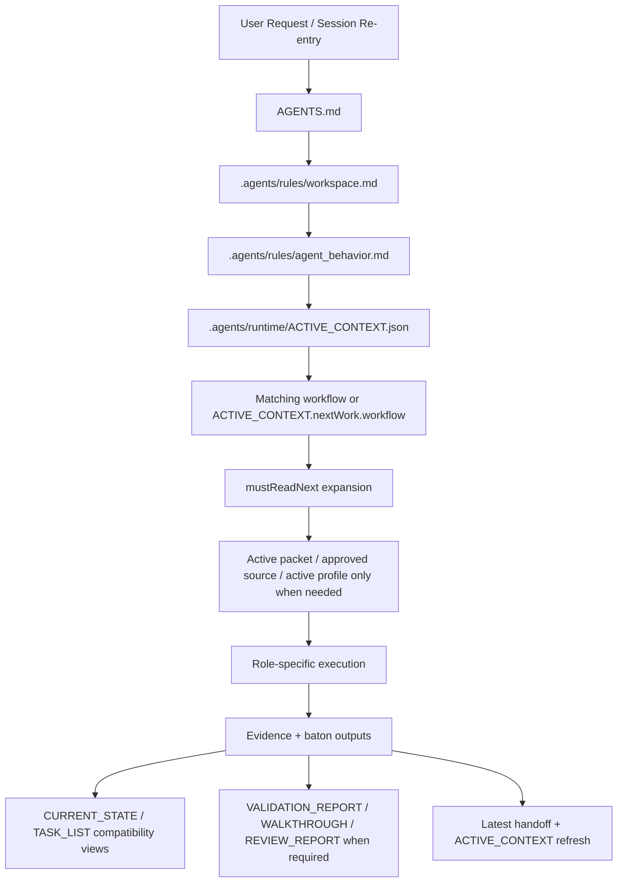

# Harness File Route Audit Matrix

## Purpose

이 문서는 하네스 문서를 증상별로 고치는 대신, 먼저 `어떤 진입점이 어떤 파일을 어떤 순서로 읽고 어떤 파일을 갱신하는가`를 체계적으로 점검하기 위한 reusable audit 기준표다.

이 문서는 authority를 대체하지 않는다.
실제 authority는 `AGENTS.md`, `.agents/rules/*`, `.agents/workflows/*`, `.agents/runtime/ACTIVE_CONTEXT.*`, active packet, approved source artifact에 있다.

## Route Overview

## Authority Classes

| Class | Typical files | Default read rule | Update rule | Audit focus |
|---|---|---|---|---|
| Constitutional entry | `AGENTS.md`, `.agents/rules/workspace.md`, `.agents/rules/agent_behavior.md` | always at route entry | edit only when reusable route/behavior contract changes | load order, authority wording, stop conditions |
| Live re-entry route | `.agents/runtime/ACTIVE_CONTEXT.json`, `.agents/runtime/ACTIVE_CONTEXT.md`, `.harness/operating_state.sqlite` | `ACTIVE_CONTEXT.json` first, DB-backed state under the hood | never hand-edit generated `ACTIVE_CONTEXT.*`; regenerate through runtime/CLI | route coherence, freshness, owner/next action parity |
| Workflow contracts | `.agents/workflows/*.md` | read the matching workflow after `ACTIVE_CONTEXT` | edit when role contract, read order, or evidence rules change | role authority, required inputs, outputs, handoff gates |
| Canonical project SSOT | `.agents/artifacts/REQUIREMENTS.md`, `ARCHITECTURE_GUIDE.md`, `IMPLEMENTATION_PLAN.md`, `ACTIVE_PROFILES.md`, `PROJECT_PROGRESS.md` | read only when the active route/task needs them | edit directly as governance truth | accuracy of approved scope, acceptance, sequencing |
| Compatibility views | `.agents/artifacts/CURRENT_STATE.md`, `.agents/artifacts/TASK_LIST.md` | read only when `mustReadNext`, packet evidence, or troubleshooting requires them | do not treat as primary route authority; keep regenerated/parity-aligned | stale wording, overuse as default input, baton readability |
| Active packet / approved source | `reference/packets/*.md`, approved source artifacts | read only when the current task depends on them | edit as task-specific authority | packet-before-code, approval boundary, required evidence |
| Reference templates/manuals | `reference/artifacts/*`, `reference/manuals/*`, `reference/profiles/*` | optional unless the active task explicitly requires them | edit when reusable guidance/template changes | optional vs mandatory drift, discoverability |
| Optional evidence artifacts | `reference/artifacts/WALKTHROUGH.md`, `REVIEW_REPORT.md`, `HANDOFF_ARCHIVE.md`, `reference/artifacts/daily/*` | create/read only when the route actually needs them | first-use creation is valid; not starter-mandatory | accidental mandatory wording, first-use guidance |

## Route Matrix

| Route | Read first | Expand only when needed | Typical outputs / updates | Stop if |
|---|---|---|---|---|
| New conversation / AI re-entry | `AGENTS.md` -> `workspace.md` -> `agent_behavior.md` -> `ACTIVE_CONTEXT.json` -> matching workflow | `mustReadNext`, active packet, approved source, active profile | none by default; route restoration only | workflow route is unclear |
| Project Manager / `day_start` | `ACTIVE_CONTEXT.json`, matching workflow or `pm.md` | compatibility views, active packet, preventive memory, optional daily note | start brief, next workflow, first action, evidence-gap summary | next owner/first action is ambiguous |
| Planner / packet opening | `ACTIVE_CONTEXT.json`, `REQUIREMENTS.md`, matching planning workflow | `CURRENT_STATE`/`TASK_LIST` when route contract requires, starter doc pack, verification template, active source, active packet draft | requirements/planning baseline updates, packet draft, approval ask | scope or approval boundary is unclear |
| Designer / UI lane | `ACTIVE_CONTEXT.json`, `REQUIREMENTS.md`, `ARCHITECTURE_GUIDE.md`, `UI_DESIGN.md` | active packet, UX archetype, source artifacts | design decisions, mockup/state expectations | no real UI scope or approval missing |
| Developer / packet implementation | `ACTIVE_CONTEXT.json`, active packet, `REQUIREMENTS.md`, `ARCHITECTURE_GUIDE.md` | targeted `IMPLEMENTATION_PLAN.md` section for sequencing/root-starter sync, verification template, cloud/local merge playbook, compatibility views when needed | code/runtime changes, required doc updates, `harness:validate`, `harness:validation-report` | packet approval or environment assumptions are missing |
| Tester / packet verification | `ACTIVE_CONTEXT.json`, active packet, `REQUIREMENTS.md`, `ARCHITECTURE_GUIDE.md` | `IMPLEMENTATION_PLAN.md` only when packet acceptance or reusable sync evidence cites it, walkthrough, verification scenario template, compatibility views when needed | tested/untested evidence, defects, optional `WALKTHROUGH.md` update | environment missing or implementation change is required |
| Reviewer / packet closeout review | `ACTIVE_CONTEXT.json`, active packet, `PACKET_EXIT_QUALITY_GATE`, `REQUIREMENTS.md`, `ARCHITECTURE_GUIDE.md` | `IMPLEMENTATION_PLAN.md` only when closeout depends on current sequencing or reusable sync expectations, verification scenario template, review report, cloud/local merge playbook | findings or approval, optional `REVIEW_REPORT.md` update | required evidence is missing |
| Deployer / cutover | `ACTIVE_CONTEXT.json`, `DEPLOYMENT_PLAN.md`, active packet, latest validation/review evidence | verification scenario template, automation catalog, cloud/local merge playbook | deployment/cutover evidence, rollback note | release approval, target, or rollback boundary is unclear |
| Handoff / baton update | `ACTIVE_CONTEXT.json`, latest handoff, active packet when one exists | compatibility views for baton wording, route troubleshooting, or generated-view drift checks; latest validation/review/deploy evidence when the baton crosses those gates | latest handoff with role-specific required SSOT, operational baton update, next owner/first action, regenerated `ACTIVE_CONTEXT`, refreshed compatibility views | target lane or owner is ambiguous |
| Documenter / `day_wrap_up` | `ACTIVE_CONTEXT.json`, workflow that owned today's work | compatibility views, packet, validation/review evidence, preventive memory, optional daily note | closeout summary, next baton, optional archive/history update | day-end state still depends on guessed status |
| Requirements deep interview / kickoff | `ACTIVE_CONTEXT.json`, planning route, `REQUIREMENTS.md` | starter doc pack, source artifacts, optional profiles | clarified requirements inputs and open questions | implementation-critical ambiguity remains |

## Review Procedure

1. Pick one route first.
2. Read only the `Read first` set for that route.
3. Expand only through the route's conditional inputs.
4. Check accuracy.
   Did the file point to the right authority, path, workflow, packet, or evidence surface?
5. Check efficiency.
   Did the file force optional artifacts as mandatory, duplicate authority, or require more reading than the route actually needs?
6. Patch reusable docs in both root and `standard-template` when the contract is starter-shipped.
7. Re-run the smallest valid verification set.
   For reusable workflow/skill/manual changes, root and `standard-template` test suites are the default check.

## Finding Types

| Type | Meaning | Example |
|---|---|---|
| Accuracy | 문서가 실제 authority/path/route를 잘못 설명함 | `reference/artifacts/DOMAIN_CONTEXT.md`처럼 존재하지 않는 경로를 필수 입력으로 적음 |
| Efficiency | 문서가 optional artifact를 기본 읽기로 강제하거나 중복 문서를 만들게 함 | daily plan을 별도 정본처럼 만들도록 유도 |
| Authority leak | generated/output surface를 primary truth처럼 취급함 | `CURRENT_STATE.md`를 항상 first-read로 강제 |
| Starter parity | root와 `standard-template`의 reusable contract가 어긋남 | root skill은 수정됐는데 starter skill은 예전 wording 유지 |
| Evidence drift | workflow가 실제 필요한 evidence를 빠뜨리거나 불필요하게 강제함 | planning-only day에도 review evidence를 강제 |

## Root / Starter Sync Rule

- reusable behavior, workflow contract, skill guidance, manual wording, packet template, profile template을 바꾸면 root와 `standard-template`를 같은 lane에서 같이 점검한다.
- maintainer-only path, release packaging, repo-local DB/runtime output, generated evidence는 root-only 또는 starter-excluded로 분리해 본다.

## Recommended Use

- 새 리뷰를 시작할 때: 먼저 이 문서에서 route를 고른다.
- 문서 수정 중 반복적으로 새 이슈가 보일 때: route를 바꾸지 말고 같은 route의 입력/출력 계층에서만 찾는다.
- 큰 정리 작업 전: 이 문서를 기준으로 `accuracy`와 `efficiency` finding을 따로 적는다.
