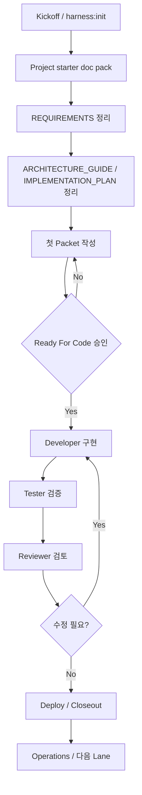
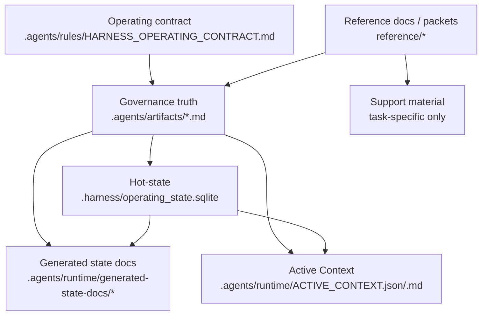

# Standard Harness Manual

이 문서는 설치된 표준 하네스를 운영하는 사람을 위한 primary manual이다.
처음 사용하는 사람은 `START_HERE.md`로 시작하고, 실제 운영 기준과 상세 설명은 이 문서를 기준으로 본다.

이 문서는 설명용 guidebook이다.
정본 SSOT, workflow authority, 승인 권한을 대체하지 않는다.

- 운영 규칙 정본: `.agents/rules/HARNESS_OPERATING_CONTRACT.md`
- 상태/승인 정본: `.agents/artifacts/*`
- 작업 단위 합의: `reference/packets/*`
- 실행 workflow 계약: `.agents/workflows/*`
- 파생 재진입 surface: `.agents/runtime/ACTIVE_CONTEXT.*`

## TOC
- [1. 하네스란 무엇인가](#1-하네스란-무엇인가)
- [2. 비전공자 운영자가 먼저 알아야 할 개념](#2-비전공자-운영자가-먼저-알아야-할-개념)
  - [2.1 먼저 구분해야 할 것](#21-먼저-구분해야-할-것)
  - [2.2 Operator One-Page Checklist](#22-operator-one-page-checklist)
  - [2.3 Profile 과 Starter Mode 다시 잡기](#23-profile-과-starter-mode-다시-잡기)
  - [2.4 Profile Reselection / Reset Playbook](#24-profile-reselection--reset-playbook)
  - [2.5 Validation Caveat](#25-validation-caveat)
  - [2.6 Safe Fix Guide](#26-safe-fix-guide)
  - [2.7 혼자 운영할 때와 Minimal Mode를 쓸 때](#27-혼자-운영할-때와-minimal-mode를-쓸-때)
- [3. 전체 생명주기](#3-전체-생명주기)
- [4. 아티팩트 맵](#4-아티팩트-맵)
- [5. 프로젝트 시작 절차](#5-프로젝트-시작-절차)
- [6. 요구사항 문서화](#6-요구사항-문서화)
- [7. 설계 산출물](#7-설계-산출물)
- [8. Packet Quick Start](#8-packet-quick-start)
- [9. 역할별 thread 운영](#9-역할별-thread-운영)
- [10. Git 과 Worktree 운영](#10-git-과-worktree-운영)
- [11. 구현 감독](#11-구현-감독)
- [12. 검증 시나리오와 테스트 운영](#12-검증-시나리오와-테스트-운영)
- [13. 배포와 운영 절차](#13-배포와-운영-절차)
- [14. 자동화 운영](#14-자동화-운영)
- [15. Cloud 와 Local 병행 작업](#15-cloud-와-local-병행-작업)
- [16. CLI 명령 레퍼런스](#16-cli-명령-레퍼런스)
- [17. 하루 운영 시나리오](#17-하루-운영-시나리오)
  - [17.1 하루 시작과 오늘 플랜 복원](#171-하루-시작과-오늘-플랜-복원)
  - [17.2 오늘 플랜 안에서 packet을 열고 닫는 흐름](#172-오늘-플랜-안에서-packet을-열고-닫는-흐름)
  - [17.3 하루 마감과 다음 세션 baton 정리](#173-하루-마감과-다음-세션-baton-정리)
- [18. 설치 후 정상 동작 확인](#18-설치-후-정상-동작-확인)
- [19. 기존 프로젝트에 적용하기](#19-기존-프로젝트에-적용하기)
- [20. 자주 쓰는 프롬프트 예시](#20-자주-쓰는-프롬프트-예시)
- [21. 실패 사례와 방어 방법](#21-실패-사례와-방어-방법)
- [22. 트러블슈팅과 FAQ](#22-트러블슈팅과-faq)

## 1. 하네스란 무엇인가

표준 하네스는 프로젝트를 어떻게 개발할지 통제하는 운영 프레임이다.
코드 생성기나 템플릿만 있는 도구가 아니라, 요구사항 정리, 승인 경계, 구현 단위 packet, handoff, 검증 리포트, 재진입 상태까지 한 흐름으로 묶는 체계다.

사람에게는 지금 어디까지 왔는지, 무엇을 결정해야 하는지, 다음에 무엇을 해야 하는지를 빠르게 보여 준다.
AI에게는 어디를 먼저 읽어야 하는지, 어떤 문서를 정본으로 따라야 하는지, 언제 구현을 멈추고 승인을 받아야 하는지를 강제한다.

이 하네스의 기본 원칙은 아래와 같다.

- 정본과 파생물을 구분한다.
- 문서와 승인 경계 없이 바로 구현하지 않는다.
- packet 없이 범위가 큰 작업을 열지 않는다.
- 사람이 승인할 지점과 AI가 실행할 지점을 섞지 않는다.
- Tester와 Reviewer를 구현자와 분리한다.
- generated file은 사람이 직접 고치는 정본이 아니다.
- manual은 설명을 제공하지만 SSOT를 대신하지 않는다.

비전공자 운영자는 개발자가 되려고 하기보다 프로젝트 통제자가 되어야 한다.
하네스의 목적은 AI가 더 많은 코드를 더 빨리 쓰게 하는 것이 아니라, AI가 잘못된 범위와 잘못된 전제로 코드를 쓰지 못하게 만드는 것이다.

## 2. 비전공자 운영자가 먼저 알아야 할 개념

| 용어 | 쉬운 설명 | 하네스에서 보는 위치 |
|---|---|---|
| Project | 하나의 업무 시스템 또는 제품 | repo root |
| Repository | 프로젝트 파일철 | Git repository |
| Branch | 원본을 직접 건드리지 않는 수정 줄기 | Git branch |
| Worktree | 같은 repository의 독립 작업 책상 | 별도 작업 폴더 |
| Commit | 특정 시점 저장 도장 | Git history |
| Pull Request | 수정본을 원본에 반영해도 되는지 검토 요청 | GitHub 등 |
| Frontend | 사용자가 보는 화면 | product source |
| Backend | 화면 뒤에서 규칙을 처리하는 서버 | product source |
| Database | 데이터를 보관하는 장부 | schema, migrations |
| API | 화면과 서버가 대화하는 통로 | API spec |
| Test | 의도대로 동작하는지 확인하는 절차 | test evidence |
| Deploy | 실제 사용 가능한 환경에 올리는 작업 | deploy packet |
| Rollback | 문제 발생 시 이전 상태로 되돌리는 작업 | rollback boundary |
| Log | 시스템이 남긴 활동 기록 | runtime logs |
| Environment | 개발, 테스트, 운영 공간 | topology evidence |
| SSOT | 하나의 사실에 대해 하나의 정본만 둔다는 원칙 | `.agents/artifacts/*` |
| Packet | 작업 범위와 승인 기준을 닫는 문서 | `reference/packets/*` |
| Active Context | 현재 상태를 다시 읽기 위한 요약 | `.agents/runtime/ACTIVE_CONTEXT.*` |
| Handoff | 다음 역할로 넘기는 명시적 전환 | handoff log |

비전공자가 특히 지켜야 할 원칙은 아래다.

- 문서는 코드보다 먼저 확정한다.
- 원본 브랜치에서 바로 기능 개발하지 않는다.
- 한 thread에 모든 일을 몰아넣지 않는다.
- 요구사항, 화면, 데이터, API, 테스트 문서가 서로 연결돼야 한다.
- 배포 전에는 롤백 방법과 백업 상태를 확인한다.
- 검증 기준 없이 "일단 만들어 달라"고 요청하지 않는다.

### 2.1 먼저 구분해야 할 것

처음 운영자가 가장 많이 헷갈리는 것은 아래 다섯 가지다.

| 항목 | 이것이 뜻하는 것 | 이것이 아닌 것 |
|---|---|---|
| manual | 사람이 읽는 설명서 | workflow authority |
| SSOT | 승인된 정본 | generated file |
| packet | 이번 작업의 범위와 승인 기준 | 아무 작업 메모 |
| profile | 어떤 종류의 일을 하는지 | governance 강도 |
| starter mode | 사람이 빠르게 고르는 운영 강도 별칭 | 설치 시 고정하는 전역 옵션 |

짧게 기억하면 이렇게 보면 된다.

- `profile`은 작업 성격이다.
- `starter mode`는 운영 강도다.
- `packet`은 이번 일의 경계다.
- `manual`은 설명서다.
- 실제 현재 상태는 DB hot-state, latest handoff, packet status, `ACTIVE_CONTEXT`를 먼저 보고, `CURRENT_STATE`와 `TASK_LIST`는 필요할 때만 compatibility/generated view로 함께 본다.

### 2.2 Operator One-Page Checklist

작업 시작 전에 아래 순서만 먼저 본다.

1. `ACTIVE_CONTEXT`를 먼저 본다.
2. `CURRENT_STATE.md`와 `TASK_LIST.md`는 `ACTIVE_CONTEXT`가 명시적으로 요구하거나 fallback/troubleshooting이 필요할 때만 본다.
3. starter를 방금 복사한 직후라면 `ACTIVE_CONTEXT.*`와 `VALIDATION_REPORT.*`가 아직 없을 수 있고, `CURRENT_STATE.md`와 `TASK_LIST.md`는 starter placeholder일 수 있으니 `harness:init` 또는 `harness:context` 이후 다시 본다.
4. 지금 작업에 packet이 필요한지 확인한다.
5. 구현이나 문서 변경이면 `Ready For Code`가 있는지 확인한다.
6. 지금 역할이 Planner, Developer, Tester, Reviewer 중 무엇인지 확인한다.
7. next workflow가 명확하지 않으면 멈추고 route를 다시 확인한다.
8. generated docs가 이상해 보여도 generated file을 직접 고치지 않는다.
9. `full-governance`는 risk-triggered 또는 explicit choice가 아니면 기본 선택으로 쓰지 않는다.
10. packet/validator에서 실제로 보는 정식 값은 `light` / `standard` / `contract` / `release` gate profile임을 기억한다.
11. 혼자 운영 중이면 solo-operation 상황임을 먼저 밝히고, 역할 분리와 approval boundary가 자동 면제되지 않는다고 본다.
12. 검증 전에 validator를 통과했다고 해서 업무 요구사항까지 다 맞는다고 생각하지 않는다.

아래 중 하나라도 해당되면 바로 멈춘다.

- 어떤 workflow로 들어가야 할지 불명확하다.
- packet 범위 밖 변경이 필요해 보인다.
- 승인 상태가 불명확하다.
- generated state와 정본 문서가 서로 다르다.
- safe fix처럼 보이지만 authority state를 바꾸게 된다.

### 2.3 Profile 과 Starter Mode 다시 잡기

운영자가 중간에 가장 많이 헷갈리는 부분은 `profile`, `starter mode`, `gate profile`을 같은 것으로 보는 것이다.

- `profile`: 어떤 종류의 프로젝트나 작업 규칙을 추가로 읽어야 하는지
- `starter mode`: manual에서 빠르게 설명하려고 쓰는 human-facing 운영 강도 별칭
- `gate profile`: packet, validator, runtime이 실제로 쓰는 정식 값

쉽게 말하면:

- `profile`은 작업의 종류를 설명한다.
- `starter mode`는 운영의 엄격함을 설명하는 쉬운 말이다.
- 실제 packet과 validator는 `light`, `standard`, `contract`, `release`를 본다.
- 현재 shipped baseline에서 설치기와 초기화 과정이 실제로 받는 선택값은 `profile`뿐이다.
- `starter mode`는 install/init 시점에 저장되는 전역 스위치가 아니라, 각 lane이나 packet을 열 때 어떤 `Gate profile`로 운영할지 설명하는 말이다.

현재 shipped baseline에서는 아래처럼 대응해서 보면 된다.

| 사람 설명 | 실제 gate profile | 언제 주로 보나 |
|---|---|---|
| `minimal` | 보통 `light` | 문서 위주, note 위주, 실행물 변화 없음 |
| `standard` | `standard` | 일반적인 packet 기반 구현/검증 |
| `full-governance` | 보통 `contract` | reusable contract, workflow, validator, root/starter sync 영향 |
| `full-governance` 중 release 성격 | `release` | installer, packaging, release baseline, cutover 영향 |

기본 판단:

| 상황 | 추천 |
|---|---|
| 혼자서 작게 검토만 한다 | `minimal` 검토 가능 |
| 일반적인 packet 기반 구현/검증 | `standard` 기본 |
| 승인 경계, 위험 변경, 릴리스/데이터 영향이 크다 | `full-governance` 검토 |

`minimal`은 빠르게 시작하기 위한 선택일 뿐, risk trigger를 무시하는 면허가 아니다.
그리고 manual에서 `full-governance`라고 설명하더라도 packet header, validator finding, transition evidence에서는 실제 gate profile id인 `contract` 또는 `release`를 찾아야 한다.

중요한 설계 포인트는 아래다.

- 같은 프로젝트라도 대화나 lane마다 운영 강도는 달라질 수 있다.
- 가벼운 문서 정리, 범위 검토, note성 작업은 `light`에 가까운 판단으로 다룰 수 있다.
- 일반 구현/검증은 보통 `standard`를 쓴다.
- reusable contract, workflow, validator, root/starter sync, release/cutover 영향이 생기면 `contract` 또는 `release`로 올린다.
- 즉 "이 프로젝트는 항상 minimal" 또는 "이 프로젝트는 항상 full-governance"처럼 프로젝트 전체에 한 번 고정하는 설계가 아니다.

### 2.4 Profile Reselection / Reset Playbook

#### 아직 승인 전

- 요구사항이나 범위가 흔들리면 Planner로 돌아간다.
- profile이 잘못 켜졌다면 profile evidence를 억지로 맞추지 말고, 어떤 profile이 필요한지 다시 정한다.
- starter mode가 애매하다면 전역 설정을 찾지 말고, 이번 lane이 어떤 `Gate profile`이어야 하는지 다시 정한다.
- packet이 없거나 packet 범위가 틀리면 구현으로 가지 않는다.

#### 상세 합의는 끝났고 구현 전

- `Ready For Code`가 없으면 Developer 작업을 열지 않는다.
- starter mode가 과하게 무겁거나 가볍다고 느껴지면 route와 active packet의 `Gate profile`을 다시 확인한다.
- manual, packet, state 문서가 서로 다른 말을 하면 먼저 정본을 맞춘다.

#### 구현이 이미 시작된 뒤

- active lane owner를 임의로 바꾸지 않는다.
- packet 범위가 틀렸다면 Developer가 계속 덮지 말고 Planner로 되돌린다.
- profile reset이 필요해도 generated docs만 고치지 말고 승인된 state operation이나 transition 경로를 쓴다.
- starter mode를 바꾸고 싶다면 active packet의 `Gate profile` 판단을 Planner가 다시 닫거나, 필요하면 새 packet/lane으로 다시 연다.
- 설치 시점의 전역 `starter mode` 값을 수정하는 절차는 없다. 현재 baseline은 그 값을 저장하지 않기 때문이다.

다시 잡아야 할 때 운영자가 바로 할 말:

```text
현재 profile 또는 starter mode 판단이 맞는지 다시 확인해 주세요.
지금 lane owner와 승인 상태를 유지한 채, 어떤 문서를 정본으로 보고 어디서 멈춰야 하는지 먼저 정리해 주세요.
```

### 2.5 Validation Caveat

validator가 `pass`라고 해서 아래까지 자동으로 보장되는 것은 아니다.

- 요구사항이 충분히 맞는지
- 업무 규칙이 올바른지
- 사람이 기대한 운영 흐름인지
- 문구가 오해 없이 읽히는지
- 실제 배포나 cutover가 안전한지

validator는 주로 이런 것을 본다.

- 정본과 파생물의 정합성
- 필요한 evidence 존재 여부
- handoff / state / packet 간 모순 여부
- freshness와 parity

따라서 `pass`는 "이제 끝"이 아니라 "다음 검토로 넘어갈 수 있는 상태"로 읽는 것이 맞다.

### 2.6 Safe Fix Guide

안전한 수정은 좁게 본다. 아래는 보통 safe fix로 볼 수 있다.

- generated docs 재생성
- `ACTIVE_CONTEXT` 재생성
- validator / validation-report 재실행
- 이미 승인된 transition 또는 state operation 재적용
- root와 `standard-template` 문구 parity 수정

아래는 safe fix로 보면 안 된다.

- `CURRENT_STATE.md`, `TASK_LIST.md`, approval state를 수동으로 사실상 재정의
- packet status를 handoff 없이 바꾸는 일
- reviewer evidence를 생략하거나 추정으로 채우는 일
- cutover / rollback 결정을 문서만 바꿔서 닫는 일
- DB hot-state를 임의로 고치는 일
- workflow authority를 manual 문구로 바꾸는 일

애매하면 이렇게 본다.

- derived output만 다시 만드는 일: 대체로 안전
- authority state를 바꾸는 일: 안전하지 않음

### 2.7 혼자 운영할 때와 Minimal Mode를 쓸 때

혼자 운영할 때도 역할 분리는 사라지지 않는다.

- 혼자 한다고 Planner와 Developer 판단을 한 문장으로 합치지 않는다.
- 혼자 한다고 Tester와 Reviewer 검증이 자동 면제되지 않는다.
- 혼자 한다고 approval boundary가 사라지지 않는다.

`minimal`을 먼저 검토해도 되는 경우:

- 요구사항 정리만 하는 초기 검토
- 구현 없는 문서 정리
- 위험이 낮은 상황 점검
- 새 lane을 열기 전 route 확인

`standard` 이상으로 올려야 하는 신호:

- 구현이 열린다
- 승인 상태가 바뀐다
- packet이 새로 열린다
- state drift나 source conflict가 있다
- 데이터, 배포, migration, cutover 성격이 보인다

## 3. 전체 생명주기

하네스는 아래 순서를 기본값으로 본다.



실전에서는 Designer, Deployer, Documenter가 중간에 추가될 수 있다.
하지만 처음 사용자는 아래 질문만 기억하면 된다.

- 지금은 kickoff 전인가, packet 전인가, 구현 중인가, 검증 중인가, closeout 중인가
- 지금 역할은 Planner, Developer, Tester, Reviewer 중 어디에 가까운가
- 다음 단계로 가려면 사람이 승인해야 하는가
- 지금 읽어야 할 정본 문서는 무엇인가
- 지금 바뀐 내용은 packet 범위 안에 있는가

## 4. 아티팩트 맵

### 4.1 정본과 파생물 관계



### 4.2 어떤 문서가 무슨 역할을 하나

| 위치 | 역할 | 언제 먼저 읽나 |
|---|---|---|
| `.agents/artifacts/REQUIREMENTS.md` | 무엇을 만들 것인가 | kickoff, 요구사항 변경 시 |
| `.agents/artifacts/ARCHITECTURE_GUIDE.md` | 어떻게 나눠 설계할 것인가 | requirements 확정 후 |
| `.agents/artifacts/IMPLEMENTATION_PLAN.md` | 현재/다음 구현 방향, 순서, blocker를 짧게 정리한 계획 정본 | lane 순서나 현재 구현 방향이 필요할 때 |
| `reference/artifacts/maintenance/ROOT_STANDARD_HARNESS_MAINTENANCE_MAP.md` | 하네스 runtime/state 유지보수 경계와 write surface | `.harness/runtime/state/*`를 수정할 때 |
| `.agents/rules/HARNESS_OPERATING_CONTRACT.md` | workflow-entry, approval boundary, packet-before-code, baton, role separation | 어떤 문서가 authority인지 헷갈릴 때 |
| `.agents/artifacts/CURRENT_STATE.md` | generated/current compatibility view | fallback, evidence 확인, troubleshooting 시 |
| `.agents/artifacts/TASK_LIST.md` | generated/task compatibility view | fallback, evidence 확인, troubleshooting 시 |
| `.agents/artifacts/DOMAIN_CONTEXT.md` | data-impact 기준선과 도메인 맥락 | 데이터/DB 영향 판단 시 |
| `.agents/artifacts/SYSTEM_CONTEXT.md` | 시스템 경계와 외부 연동 맥락 | system boundary 판단 시 |
| `.agents/artifacts/PROJECT_HISTORY.md` | 장기 rebaseline과 과거 결정 이력 | 과거 변경이 현재 판단에 영향 줄 때 |
| `.agents/artifacts/PREVENTIVE_MEMORY.md` | 반복 friction, repeated mistake/trigger, follow-up 후보 | 같은 문제가 반복될 때 |
| `.agents/runtime/ACTIVE_CONTEXT.json` | AI가 빠르게 재진입하는 compact 상태 | AI 재진입 첫 읽기 |
| `.agents/runtime/ACTIVE_CONTEXT.md` | 사람이 빠르게 재진입하는 한국어 요약 | 사람이 상태 요약 볼 때 |
| `reference/planning/*` | planning 기준과 decision history | kickoff, planning 시 |
| `reference/packets/*` | 작업 단위 packet | 구현 직전과 구현 중 |
| `reference/profiles/*` | 특정 프로젝트 유형용 선택 규칙 | profile을 켤 때 |
| `reference/artifacts/PROJECT_STARTER_DOC_PACK.md` | 프로젝트 시작 질문지 | 새 프로젝트 시작 시 |
| `reference/artifacts/VERIFICATION_SCENARIO_TEMPLATE.md` | 검증 시나리오 틀 | packet 검증 기준 작성 시 |
| `reference/artifacts/WALKTHROUGH.md` | Tester walkthrough 기준 | walkthrough와 재현 순서를 정리할 때. fresh starter에는 없을 수 있으니 첫 test/review 시 생성 |
| `reference/artifacts/PACKET_EXIT_QUALITY_GATE.md` | Reviewer closeout 기준 | reviewer/closeout 준비 시 |
| `reference/artifacts/REVIEW_REPORT.md` | Reviewer findings와 closeout 기록 | reviewer 결과를 확인할 때. fresh starter에는 없을 수 있으니 첫 review 시 생성 |
| `reference/artifacts/HARNESS_FILE_ROUTE_AUDIT_MATRIX.md` | 진입점/워크플로별 파일 read-update 기준표 | 하네스 문서를 체계적으로 검토하거나 route confusion을 점검할 때 |
| `reference/manuals/ROLE_THREAD_PLAYBOOK.md` | role/thread 시작 가이드 | 새 AI thread를 열 때 |
| `reference/manuals/AUTOMATION_CATALOG.md` | 자동화 선택 가이드 | 반복 점검을 예약할 때 |
| `reference/manuals/CLOUD_LOCAL_MERGE_PLAYBOOK.md` | cloud/local 병렬 작업 가이드 | cloud나 별도 worktree 병렬 작업을 쓸 때 |

정본과 파생물을 헷갈리면 안 된다.

- `.agents/rules/HARNESS_OPERATING_CONTRACT.md`는 reusable operating-rule authority다.
- `.agents/artifacts/*`는 사람이 승인하는 상태/계획 정본이다.
- `.agents/runtime/*`는 재생성 가능한 파생물이다.
- `reference/*`는 설명, 템플릿, evidence, packet history를 담는 보조 자료다.
- 다만 active packet이나 approved source는 해당 작업에서 필수 입력이 될 수 있다.
- generated surface가 이상하면 generated file을 고치지 말고 정본과 상태를 먼저 맞춘다.
- starter source는 fresh pre-init 상태를 유지해야 한다. copied starter에 필요한 generated output은 init/context/validation 명령으로 다시 만든다.
- fresh starter는 `DECISION_LOG.md`, `HANDOFF_ARCHIVE.md`, `REVIEW_REPORT.md`, `WALKTHROUGH.md`, `reference/artifacts/daily/*`를 기본 탑재하지 않을 수 있다. 이 문서들은 첫 review, first handoff archive, daily note가 실제로 필요할 때 프로젝트 안에 생성한다.
- 설치된 프로젝트에서는 `README.md`, `START_HERE.md`, 현재 repo의 validator 결과를 기준으로 보고, 존재하지 않는 `installer/`, `packaging/`, `standard-template/` maintainer 경로까지 운영자가 따라가지는 않는다.

## 5. 프로젝트 시작 절차

새 프로젝트를 시작할 때는 바로 구현하지 않는다.
먼저 [PROJECT_STARTER_DOC_PACK.md](../artifacts/PROJECT_STARTER_DOC_PACK.md)를 채운다.

설치와 초기화 단계에서 먼저 구분할 점:

- 설치기와 `harness:init`이 직접 받는 선택값은 `Active profiles`다.
- `starter mode`는 이 시점에 고르는 별도 입력값이 아니다.
- 실제 운영 강도는 첫 packet을 열 때 `Gate profile`을 `light` / `standard` / `contract` / `release` 중 무엇으로 둘지 결정하면서 정한다.
- 그래서 설치 후에 "starter mode를 바꾸는 명령"을 찾기보다, 현재 또는 다음 packet의 `Gate profile` 판단이 맞는지 보는 것이 맞다.

처음에 닫아야 할 항목은 아래다.

1. 프로젝트 목적 정의
2. 사용자 역할 정의
3. 업무 흐름 정의
4. 기능 범위와 제외 범위 정의
5. 화면 목록 정의
6. 데이터 항목 정의
7. 권한과 승인 규칙 정의
8. 테스트 기준 정의
9. 배포 및 운영 기준 정의
10. 그다음에 구현 시작

운영자가 해야 할 일은 완벽한 설계서를 처음부터 쓰는 것이 아니다.
빠진 질문을 드러내고, 구현을 시작해도 되는 수준까지 모호함을 줄이는 것이다.

처음 사용자 기준 작업 순서:

1. `npm run harness:init`
2. `npm run harness:status`
3. `npm run harness:next`
4. starter doc pack rough draft 작성
5. `REQUIREMENTS.md` 기준 요구사항 정리
6. `ARCHITECTURE_GUIDE.md` 기준 설계 boundary 정리
7. `IMPLEMENTATION_PLAN.md`에 현재/다음 구현 순서와 blocker를 짧게 정리
8. 첫 packet drafting
9. `Ready For Code` 승인
10. 구현 thread 시작

처음부터 모든 문서를 완벽히 닫으려 하지 말고, 아래 세 단계를 나눈다.

- 초안: 빠진 항목을 보이게 만든다.
- 합의안: 사람이 판단해야 할 선택지를 줄인다.
- 승인안: 구현자가 임의 해석하지 않아도 되는 상태로 만든다.

## 6. 요구사항 문서화

요구사항은 "기능 목록"이 아니라 구현과 검증을 통제하는 기준이다.
요구사항이 약하면 AI는 빈칸을 그럴듯하게 채운다.

요구사항 문서에는 최소한 아래가 있어야 한다.

- 프로젝트 목적
- 사용자 역할
- 핵심 업무 흐름
- 기능 범위
- 제외 범위
- 화면 목록
- 데이터 항목
- 권한과 승인 규칙
- 외부 연동
- 테스트 기준
- 배포 및 운영 기준
- 미결정 사항

좋은 요구사항 문장은 아래처럼 검증 가능해야 한다.

```text
요청자는 본인이 작성한 결재 요청만 수정할 수 있다.
팀장은 자신에게 배정된 결재 요청을 승인 또는 반려할 수 있다.
회계 담당자는 팀장 승인 이후의 요청만 회계 승인할 수 있다.
```

나쁜 요구사항 문장은 아래처럼 해석 여지가 크다.

```text
권한을 잘 처리한다.
결재가 편하게 되게 한다.
관리자가 볼 수 있게 한다.
```

요구사항이 바뀌면 구현 thread에서 바로 수정하지 않는다.
Planner가 요구사항과 packet 범위를 다시 닫고, 변경된 정본을 기준으로 구현을 이어간다.

## 7. 설계 산출물

설계 산출물은 개발자가 알아서 만들게 두는 그림이 아니다.
비전공자 운영자가 "무엇이 결정됐고 무엇이 아직 열려 있는지" 볼 수 있어야 한다.

권장 설계 산출물:

- 업무 흐름도
- 화면 목록
- 화면별 입력/출력
- 데이터 항목표
- 권한 매트릭스
- API 목록
- 핵심 API 명세
- 오류 처리 기준
- 감사/로그 기준
- 배포 환경 기준
- 롤백 기준

API가 있는 프로젝트라면 최소 API 명세는 아래 형식을 권장한다.

```text
API name:
Purpose:
Caller:
Endpoint:
Method:
Request fields:
Response fields:
Permission rule:
Error cases:
Test scenarios:
```

데이터 항목은 아래처럼 업무 말과 기술 말을 같이 적는다.

```text
Business name: 결재 금액
Field name: approval_amount
Type: number
Required: yes
Rule: 0보다 커야 한다
Visible to: 요청자, 결재자, 회계 담당자
Audit: 변경 기록 필요
```

설계가 완성되지 않아도 된다.
다만 구현을 여는 packet에서 다루는 범위만큼은 설계와 검증 기준이 닫혀 있어야 한다.

## 8. Packet Quick Start

`reference/packets/PKT-01_WORK_ITEM_PACKET_TEMPLATE.md`는 길다.
처음부터 모든 필드를 완벽하게 채우려 하면 오히려 시작이 느려진다.

처음 packet에서는 아래를 먼저 채운다.

- 이 작업의 goal
- in-scope / out-of-scope
- 상세 동작 또는 화면 변화
- acceptance
- human approval boundary
- 검증 시나리오
- rollback 또는 revert 기준

그 다음, 아래 질문에 yes가 나오면 관련 필드를 추가한다.

- 기존 시스템이나 DB와 연결되는가
- user-facing 화면과 UX를 결정하는가
- profile이 켜져 있는가
- deploy, migration, cutover 성격인가
- 외부 source나 spreadsheet를 authoritative source로 받는가
- cloud 또는 별도 worktree에서 병렬 작업할 것인가

검증 시나리오는 [VERIFICATION_SCENARIO_TEMPLATE.md](../artifacts/VERIFICATION_SCENARIO_TEMPLATE.md)를 사용한다.
Planner는 packet을 열 때 이 템플릿을 보고 normal, error, permission, regression, manual check가 필요한지 판단한다.

packet을 새로 열 때는 아래 세 가지를 먼저 맞춘다.

- `reference/packets/*.md` 경로에 concrete packet 초안을 둔다.
- Quick Decision Header에서 gate profile과 approval boundary를 먼저 드러낸다.
- `contract` gate라면 최소 `Ready For Code`, root/starter sync, targeted check, validator, active context, review closeout 근거가 Verification Manifest에 보여야 opening validation hold를 줄일 수 있다.

packet lifecycle를 가장 짧게 요약하면 아래 순서다.

1. Planner가 requirements, architecture, active source, 그리고 필요하면 targeted implementation plan section을 기준으로 packet 초안을 연다.
2. packet에 goal, scope, acceptance, approval boundary, verification scenario를 닫는다.
3. 사용자가 `Ready For Code`를 명시적으로 승인한다.
4. Developer가 packet 범위 안에서 구현하고 필요한 validation evidence를 남긴다.
5. Tester가 packet acceptance 기준으로 검증하고 walkthrough evidence를 남긴다.
6. Reviewer가 packet exit quality gate와 review evidence를 보고 closeout 또는 remediation handoff를 결정한다.

처음 사용자 기준으로는 필수 최소 필드를 먼저 닫고, profile이나 migration이 얽힐 때만 확장하는 것이 맞다.

## 9. 역할별 thread 운영

[ROLE_THREAD_PLAYBOOK.md](./ROLE_THREAD_PLAYBOOK.md)는 workflow를 대체하는 문서가 아니다.
사용자가 새 대화창을 열 때 "이 thread는 어떤 역할이며 어디까지 할 수 있는가"를 복사해서 시작하기 위한 가이드다.

즉, 이 문서를 보고 아래처럼 thread 첫 프롬프트를 만든다.

```text
Role: Planner
Goal: 구매결재 시스템의 첫 구현 packet을 준비한다.
Allowed scope: 요구사항 정리, packet 범위, 승인 질문
Do not: 코드 수정, 구현 시작
Required inputs: ACTIVE_CONTEXT, REQUIREMENTS, active packet/source docs, starter doc pack
Compatibility fallback: read CURRENT_STATE/TASK_LIST only when ACTIVE_CONTEXT explicitly requires them or troubleshooting needs them
Expected output: packet draft, open decisions, Ready For Code 승인 질문
Validation: source/evidence 누락이 없어야 함
Next handoff: Developer
```

역할별 thread를 나누는 이유는 AI 성능을 높이기 위해서만이 아니다.
한 thread에 기획, 구현, 검증, 리뷰가 섞이면 이전 대화의 임시 결정이 정본처럼 취급될 수 있다.
하네스는 handoff로 상태를 이어가고, thread는 역할과 목적을 좁혀서 맥락 오염을 줄인다.

권장 thread 분리:

- Planning thread: 요구사항, scope, approval
- Design thread: 화면, 데이터, API, 권한 구조
- Developer thread: 승인된 packet 구현
- Tester thread: 제품 기능/요구사항/packet acceptance 검증과 tested/untested evidence
- Reviewer thread: packet acceptance, 회귀, 보안·release risk, closeout 판단
- Deploy thread: 배포, rollback, 운영 인계

## 10. Git 과 Worktree 운영

하네스의 strong default는 원본 브랜치에서 바로 기능 개발하지 않는 것이다.

branch 또는 worktree를 써야 하는 경우:

- 새 기능 구현
- 위험한 리팩터링
- 병렬 packet 작업
- 오래 걸리는 분석이나 수정
- cloud 작업 결과를 로컬로 가져와 검증해야 하는 경우

예외는 가능하지만 기록해야 한다.

- 좁은 starter/manual 문서 동기화
- 매우 작은 긴급 수정
- 구현을 열지 않는 planning-only 작업

예외를 썼다면 packet, handoff, closeout note 중 하나에 이유를 남긴다.

운영자가 Codex에게 요청할 때는 이렇게 말한다.

```text
이번 작업은 원본 브랜치에서 직접 개발하지 말고 별도 branch 또는 worktree 계획을 먼저 제시해 주세요.
예외가 필요하면 이유와 리스크를 packet 또는 handoff에 남겨 주세요.
```

merge 전에는 아래를 본다.

- 의도한 파일만 바뀌었는가
- packet 범위 밖 변경이 섞였는가
- 테스트와 validation evidence가 최신인가
- conflict 해결 과정에서 요구사항이 바뀌지 않았는가

## 11. 구현 감독

비전공자 운영자는 코드를 모두 이해하지 못해도 구현을 감독할 수 있다.
중요한 것은 코드 줄 하나하나가 아니라, 구현이 승인된 packet과 검증 기준을 벗어나지 않는지 보는 것이다.

Developer에게 맡기기 전 확인할 것:

- `Ready For Code`가 승인됐는가
- packet scope가 닫혔는가
- 필요한 source 문서가 모두 읽혔는가
- 변경 금지 영역이 명시됐는가
- 검증 시나리오가 준비됐는가
- branch/worktree 계획이 있는가

Developer 결과를 받을 때 확인할 것:

- 바뀐 파일 목록
- 구현 요약
- 실행한 테스트
- 실패하거나 생략한 테스트
- validation-report 결과
- 다음 handoff 대상

좋은 구현 closeout 예:

```text
Current Work:
- OPS-XX 범위 안에서 승인 API와 권한 검사를 구현했습니다.
- root/starter tests는 통과했습니다.
- validate와 validation-report는 pass입니다.

Next Work:
- Tester가 normal/error/permission/regression/manual check를 검증해야 합니다.
- 권한 우회 시나리오를 특히 확인해야 합니다.
```

## 12. 검증 시나리오와 테스트 운영

검증은 테스트를 돌렸다는 말로 끝나지 않는다.
무엇을 검증했는지, 무엇을 검증하지 못했는지, 어떤 evidence가 남았는지가 보여야 한다.

[VERIFICATION_SCENARIO_TEMPLATE.md](../artifacts/VERIFICATION_SCENARIO_TEMPLATE.md)는 이때 쓰는 공통 틀이다.
`plan.md`는 packet의 검증 기준을 잡을 때 이 템플릿을 참조하고, `test.md`는 Tester가 검증 evidence를 남길 때 이 템플릿을 참조한다.

Tester는 harness mechanic보다 먼저 제품 기능, 요구사항, packet acceptance, applicable security-sensitive behavior를 본다.
결함이 보여도 직접 고치지 않고 tested scope와 untested scope를 분리해 Developer나 Reviewer가 이어갈 수 있게 남긴다.

Reviewer는 Tester evidence만 보는 역할이 아니다.
`reference/artifacts/WALKTHROUGH.md`, `reference/artifacts/PACKET_EXIT_QUALITY_GATE.md`, `reference/artifacts/REVIEW_REPORT.md`까지 보고 closeout 가능 여부, residual risk, release risk를 판단한다.

기본 묶음:

- Normal: 정상 흐름
- Error: 잘못된 입력이나 실패 흐름
- Permission: 권한과 승인 규칙
- Regression: 기존 기능이 깨지지 않았는지
- Manual Check: 사람이 직접 확인해야 하는 화면, 로그, 리포트

검증 요청 예:

```text
OPS-XX packet 기준으로 검증해 주세요.
VERIFICATION_SCENARIO_TEMPLATE의 normal, error, permission, regression, manual check 기준으로 tested scope와 untested scope를 나눠 주세요.
결함이 있으면 직접 수정하지 말고 Developer handoff용으로 재현 절차를 남겨 주세요.
```

## 13. 배포와 운영 절차

배포나 cutover는 기능 구현이 끝났다는 이유만으로 열지 않는다.
아래가 보일 때만 배포 lane을 연다.

- 배포 대상 환경
- 실행 명령
- 환경 변수와 secret 처리 기준
- DB migration 여부
- 백업 여부
- rollback 방법
- 운영 담당자와 연락 기준
- 장애 시 첫 대응
- validation evidence

배포 전 질문:

- 지금 배포하지 않으면 어떤 문제가 있는가
- 배포 실패 시 몇 분 안에 되돌릴 수 있는가
- 어떤 데이터가 손상될 수 있는가
- 사용자는 어떤 변화를 보게 되는가
- 배포 후 smoke test는 무엇인가

운영 단계에서 중요한 것:

- 계정/권한 변경 기록
- 장애 대응 절차
- 수동 데이터 수정 절차
- 정기 점검 및 재검토 루프
- stale packet이나 오래된 validation 점검

## 14. 자동화 운영

[AUTOMATION_CATALOG.md](./AUTOMATION_CATALOG.md)는 자동화를 실제로 생성하는 파일이 아니다.
어떤 반복 점검을 자동화로 돌릴지 고르는 운영 카탈로그다.

사용 시점:

- active lane이 며칠 이상 길어질 때
- 여러 사람이 같은 프로젝트를 이어받을 때
- 실패 테스트가 반복될 때
- 배포 전 체크리스트를 반복 확인해야 할 때
- planning hold 상태가 오래 지속될 때

대표 자동화:

- Daily State Summary: 매일 open lane, next action, validation stale 여부 요약
- Failed Test Digest: 실패 테스트와 반복 실패 지점 요약
- Planning Hold Reminder: no-active-lane 상태 장기화 점검
- Pre-Deploy Checklist Reminder: rollback, validation, approval 누락 점검

자동화는 판단을 대신하지 않는다.
자동화 결과는 사람이 읽는 summary이고, 정본 변경은 여전히 packet, workflow, approval 경계를 따른다.

## 15. Cloud 와 Local 병행 작업

[CLOUD_LOCAL_MERGE_PLAYBOOK.md](./CLOUD_LOCAL_MERGE_PLAYBOOK.md)는 cloud/local 병렬 작업을 자동으로 병합하는 기능 설명이 아니다.
cloud에서 오래 걸리는 후보 작업을 돌렸을 때 로컬 정본으로 어떻게 안전하게 가져올지 설명하는 운영 가이드다.

사용 시점:

- cloud에서 오래 걸리는 분석을 맡길 때
- cloud와 local에서 서로 다른 범위를 병렬 구현할 때
- 별도 worktree 여러 개를 동시에 운영할 때
- cloud output을 branch, patch, PR 형태로 가져올 때

핵심 원칙:

- local canonical truth가 우선이다.
- cloud output은 candidate다.
- cloud 결과는 local diff review, merge, test, validate 후에만 정본 반영 후보가 된다.
- handoff와 closeout은 local에서 검증된 결과 기준으로만 남긴다.

좋은 분리 예:

- cloud A: backend permission middleware 초안
- cloud B: frontend menu visibility 초안
- local: requirements, packet, merge, validation 관리

나쁜 분리 예:

- cloud가 requirements를 임의 변경
- local validation 없이 cloud 결과를 정본으로 반영
- 같은 파일을 여러 cloud 작업이 동시에 수정

## 16. CLI 명령 레퍼런스

아래 명령은 설치된 프로젝트 루트에서 사용한다.

### `npm run harness:init`
- 목적: 새 프로젝트를 하네스 usable state로 초기화한다.
- 언제 쓰나: starter를 복사한 직후, 또는 빈 프로젝트에 하네스를 막 올린 직후.
- 기대 출력: 프로젝트 이름, 목표, profile 같은 초기 질문을 받고 기본 artifact와 state가 생성된다.
- 실패 시 첫 대응: Node.js 24 이상인지, 현재 위치가 프로젝트 루트인지 확인한다.
- 관련 아티팩트: `.harness/operating_state.sqlite`, `.agents/artifacts/*`, `.agents/runtime/*`

### `npm run harness:status`
- 목적: 현재 단계, 현재 focus, 다음 action을 짧게 본다.
- 언제 쓰나: 하루 시작, 중단 후 복귀, handoff 직후.
- 기대 출력: 현재 stage, focus, next action 요약이 나온다.
- 실패 시 첫 대응: `harness:init`이 끝났는지, `ACTIVE_CONTEXT.*`와 DB 상태가 비어 있지 않은지 확인한다. 필요하면 `CURRENT_STATE.md`를 compatibility view로 확인한다.
- 관련 아티팩트: `ACTIVE_CONTEXT.*`, `CURRENT_STATE.md`

### `npm run harness:next`
- 목적: 다음 workflow와 구체 next work를 확인한다.
- 언제 쓰나: 지금 뭘 해야 할지 애매할 때.
- 기대 출력: 다음 owner, workflow, next first action이 나온다.
- 실패 시 첫 대응: `ACTIVE_CONTEXT.*`와 최신 handoff가 비어 있지 않은지 확인한다. 필요하면 `TASK_LIST.md`를 compatibility view로 확인한다.
- 관련 아티팩트: `ACTIVE_CONTEXT.*`, `TASK_LIST.md`

### `npm run harness:context`
- 목적: AI용 JSON과 사람용 Markdown active context를 생성 또는 갱신한다.
- 언제 쓰나: init 직후, handoff 직후, closeout 직후, stale 의심 시.
- 기대 출력: `ACTIVE_CONTEXT.json`과 `ACTIVE_CONTEXT.md`가 최신 상태로 생성된다.
- 실패 시 첫 대응: `.harness/operating_state.sqlite` 존재 여부와 validator 오류를 먼저 확인한다.
- 관련 아티팩트: `.agents/runtime/ACTIVE_CONTEXT.json`, `.md`

### `npm run harness:doctor`
- 목적: 하네스 운영 상태를 빠르게 진단한다.
- 언제 쓰나: init이 이상할 때, 명령이 어색하게 동작할 때, 설치 환경을 점검할 때.
- 기대 출력: 환경과 하네스 상태에 대한 점검 요약이 나온다.
- 실패 시 첫 대응: Node.js 버전, 루트 경로, 필수 파일 존재 여부를 먼저 확인한다.

### `npm run harness:validate`
- 목적: 현재 정본, packet, generated state, profile evidence가 규칙에 맞는지 검사한다.
- 언제 쓰나: 구현 전, handoff 전, closeout 전, 문서/상태를 크게 바꾼 뒤.
- 기대 출력: `ok: true` 또는 findings 목록이 나온다.
- 실패 시 첫 대응: findings에서 가장 위에 나온 missing evidence나 stale parity를 먼저 해결한다.

### `npm run harness:validation-report`
- 목적: validator 결과를 Markdown과 JSON 리포트로 저장한다.
- 언제 쓰나: closeout 전, review 전, evidence를 남겨야 할 때.
- 기대 출력: `VALIDATION_REPORT.md`와 `VALIDATION_REPORT.json` 경로, gate decision, next action이 나온다.
- 실패 시 첫 대응: 먼저 `harness:validate`를 실행해 blocking finding부터 없앤다.

### `npm run harness:handoff`
- 목적: 다음 역할로 넘길 handoff 내용을 확인하거나 생성 흐름을 돕는다.
- 언제 쓰나: 구현 완료 후 Tester로 넘길 때, Tester 후 Reviewer로 넘길 때, Planner가 다음 owner를 정리할 때.
- 기대 출력: 현재 기준으로 추천되는 next owner와 handoff 요약 방향이 나온다.
- 실패 시 첫 대응: `ACTIVE_CONTEXT.*`, latest handoff, active packet이 실제 상황과 맞는지 먼저 본다. 필요하면 `CURRENT_STATE.md`와 `TASK_LIST.md`를 compatibility view로 대조한다.

### `npm run harness:explain`
- 목적: 현재 하네스 상태를 조금 더 풀어서 설명한다.
- 언제 쓰나: `status`가 너무 짧아서 현재 맥락을 더 이해하고 싶을 때.
- 기대 출력: stage, next work, blockers, source trace가 확장 설명 형태로 나온다.
- 실패 시 첫 대응: `harness:context`를 다시 실행해 stale 상태를 먼저 줄인다.

### `npm run harness:transition`
- 목적: 승인된 workflow 전환을 preview/apply 형태로 반영한다.
- 언제 쓰나: Planner에서 Developer로 넘길 때, Developer에서 Tester로 넘길 때, Reviewer closeout 후 다음 lane으로 넘길 때.
- 기대 출력: preview 또는 apply 결과와 post-apply validation 요약이 나온다.
- 실패 시 첫 대응: `Ready For Code`, open decision, packet closeout 상태가 실제로 충족되었는지 먼저 확인한다.

### `npm run harness:migration-preview`
- 목적: 기존 프로젝트 상태를 하네스 기준으로 어떻게 읽고 적용할지 미리 본다.
- 언제 쓰나: 이미 진행 중인 프로젝트에 하네스를 붙일 때.
- 기대 출력: 무엇이 legacy source로 감지됐고 어떤 정리가 필요한지 preview가 나온다.
- 실패 시 첫 대응: 기존 프로젝트의 주요 문서와 source root가 실제로 존재하는지 확인한다.

### `npm run harness:migration-apply`
- 목적: preview에서 확인한 초기 정리를 실제 하네스 상태에 반영한다.
- 언제 쓰나: migration preview 결과를 검토하고 적용하기로 결정한 뒤.
- 기대 출력: legacy source refs 정리와 초기 state 반영 결과가 나온다.
- 실패 시 첫 대응: preview를 다시 보고, 자동 반영해도 되는 범위인지 먼저 확인한다.

### `npm run harness:cutover-preflight`
- 목적: 컷오버 전에 validator, migration 상태, rollback 준비가 맞는지 확인한다.
- 언제 쓰나: 실제 전환 직전.
- 기대 출력: 컷오버 가능 여부와 부족한 증거가 나온다.
- 실패 시 첫 대응: validator error, migration 잔여 항목, rollback bundle 누락을 먼저 확인한다.

### `npm run harness:cutover-report`
- 목적: 컷오버 근거를 report artifact로 남긴다.
- 언제 쓰나: preflight가 통과하고 최종 evidence를 남길 때.
- 기대 출력: Markdown/JSON 컷오버 리포트가 생성된다.
- 실패 시 첫 대응: `cutover-preflight`를 다시 실행해 blocker가 없는지 먼저 확인한다.

## 17. 하루 운영 시나리오

### 17.1 하루 시작과 오늘 플랜 복원

이 하네스에서 `오늘의 플랜`은 별도 정본 문서가 아니다.
하루 시작 시점의 계획은 `ACTIVE_CONTEXT`, active workflow, active packet, latest handoff에서 복원한다.

1. 사람은 먼저 `npm run harness:status`와 `npm run harness:next`를 본다.
문서 참조: `.agents/runtime/ACTIVE_CONTEXT.md` 또는 CLI 출력
2. AI는 `.agents/runtime/ACTIVE_CONTEXT.json`을 먼저 읽고 `selected lane`, `next workflow`, `mustReadNext`, `approval boundary`를 복원한다.
문서 참조: `.agents/runtime/ACTIVE_CONTEXT.json`, matching `.agents/workflows/*.md`
3. `mustReadNext`나 troubleshooting이 요구할 때만 `CURRENT_STATE.md`와 `TASK_LIST.md`를 fallback으로 읽는다.
문서 참조: `.agents/artifacts/CURRENT_STATE.md`, `.agents/artifacts/TASK_LIST.md`
4. 오늘 첫 action이 packet 생성인지, packet 구현인지, packet 검증인지, packet closeout인지 판정한다.
문서 참조: active `reference/packets/*.md`, `.agents/artifacts/REQUIREMENTS.md`, 필요하면 `.agents/artifacts/IMPLEMENTATION_PLAN.md`
5. route가 불명확하면 구현을 시작하지 않고 `Project Manager` 또는 `Handoff` 관점으로 정리한다.
문서 참조: `.agents/skills/day_start/SKILL.md`, `.agents/workflows/pm.md`, `.agents/workflows/handoff.md`, `reference/manuals/ROLE_THREAD_PLAYBOOK.md`

효율 규칙:
- `CURRENT_STATE`와 `TASK_LIST`를 매일 기본 입력처럼 읽지 않는다.
- daily note는 선택 사항이다. `reference/artifacts/daily/*`는 recent human delta가 정말 필요할 때만 쓴다.
- 오늘 플랜은 `Current Work` / `Next Work`와 active packet에서 복원하지, 새 daily-plan 문서를 따로 만들지 않는다.

### 17.2 오늘 플랜 안에서 packet을 열고 닫는 흐름

1. active packet이 없거나 승인 경계가 바뀌었으면 Planner가 오늘 플랜의 첫 일로 packet을 연다.
문서 참조: `.agents/workflows/plan.md`, `reference/packets/PKT-01_WORK_ITEM_PACKET_TEMPLATE.md`, `.agents/artifacts/REQUIREMENTS.md`, `.agents/artifacts/ARCHITECTURE_GUIDE.md`, 필요하면 `.agents/artifacts/IMPLEMENTATION_PLAN.md`
2. packet에는 최소 goal, scope, acceptance, approval boundary, verification scenario를 먼저 닫는다.
문서 참조: `reference/artifacts/VERIFICATION_SCENARIO_TEMPLATE.md`
3. `Ready For Code`가 닫히기 전에는 Developer로 넘어가지 않는다.
문서 참조: `.agents/rules/HARNESS_OPERATING_CONTRACT.md`, active packet Quick Decision Header / Verification Manifest
4. 승인 후 Developer가 packet 범위 안에서만 구현하고 필요한 evidence를 남긴다.
문서 참조: `.agents/workflows/dev.md`, active packet, `.agents/artifacts/VALIDATION_REPORT.*` when required
5. Tester는 제품 기능, requirements, packet acceptance 기준으로 검증하고 walkthrough가 필요할 때만 생성/갱신한다.
문서 참조: `.agents/workflows/test.md`, `reference/artifacts/WALKTHROUGH.md`, `reference/artifacts/VERIFICATION_SCENARIO_TEMPLATE.md`
6. Reviewer는 packet exit quality gate와 review evidence를 보고 closeout 또는 remediation handoff를 결정한다.
문서 참조: `.agents/workflows/review.md`, `reference/artifacts/PACKET_EXIT_QUALITY_GATE.md`, `reference/artifacts/REVIEW_REPORT.md`
7. route가 바뀌면 Handoff가 baton을 정리하고, packet이 닫히지 않았으면 다음 세션 first action을 packet 기준으로 남긴다.
문서 참조: `.agents/workflows/handoff.md`, latest handoff, active packet

효율 규칙:
- packet이 하루를 넘겨도 괜찮다. 중요한 것은 packet 상태와 next first action이 명확한 것이다.
- planning-only day에는 review/test evidence 문서를 억지로 만들지 않는다.
- 반대로 implementation/verification/review day에는 필요한 validation evidence 없이 handoff하지 않는다.

### 17.3 하루 마감과 다음 세션 baton 정리

1. 오늘 실제로 끝난 것과 남은 것을 구분한다.
문서 참조: active packet, latest handoff, `.agents/runtime/ACTIVE_CONTEXT.json`
2. 오늘 work type에 따라 필요한 검증만 실행한다.
- planning-only day: planning baseline과 baton 정합성을 확인한다.
- implementation/verification/review day: owning workflow가 요구하는 `harness:validate`, `harness:validation-report`, walkthrough, review evidence를 확인한다.
3. `Current Work`와 `Next Work`를 기록해 다음 workflow와 첫 action을 분명히 남긴다.
문서 참조: 모든 `.agents/workflows/*.md`의 Turn Close Reporting, `.agents/rules/HARNESS_OPERATING_CONTRACT.md`
4. next owner, next first action, required SSOT, do-not-cross가 분명할 때만 day wrap을 끝낸다.
문서 참조: `.agents/workflows/handoff.md`, latest handoff, `.agents/runtime/ACTIVE_CONTEXT.*`
5. 반복 friction이 명확한 trigger/rule/check method로 재사용 가능할 때만 `PREVENTIVE_MEMORY.md`에 남긴다.
문서 참조: `.agents/artifacts/PREVENTIVE_MEMORY.md`
6. human-facing 하루 메모가 진짜 필요할 때만 `reference/artifacts/daily/*`를 만든다.

효율 규칙:
- 하루 마감은 별도 회고 문서를 매일 강제하는 절차가 아니다.
- 다음 세션이 바로 시작할 수 있게 baton이 명확하면 좋은 closeout이다.
- `day_wrap_up`은 PM lens의 정리 흐름이고, 다른 workflow의 승인 권한을 가져오지 않는다.

## 18. 설치 후 정상 동작 확인

처음 사용자는 아래 네 단계까지만 확인하면 된다.

1. `npm run harness:init`
2. `npm run harness:status`
3. `npm run harness:context`
4. `npm run harness:validate`

기대 결과:

- 초기 질문이 끝나고 프로젝트 초기화가 완료된다.
- 현재 stage와 next action이 나온다.
- `.agents/runtime/ACTIVE_CONTEXT.json`과 `.md`가 생성된다.
- validator 결과가 이해 가능한 형태로 나온다.

실패하면 가장 먼저 볼 것:

- Node.js 24 이상인지
- 현재 위치가 프로젝트 루트인지
- `.harness/operating_state.sqlite`가 있는지
- `VALIDATION_REPORT`의 첫 finding이 무엇인지

처음 사용자는 위 순서만 읽고도 30분 이내에 첫 init과 기본 상태 점검까지 도달하는 것을 목표로 한다.

## 19. 기존 프로젝트에 적용하기

이미 진행 중인 프로젝트에도 하네스를 붙일 수 있다.
이 경우에는 새 프로젝트처럼 바로 requirements부터 다시 쓰기보다, 현재 상태를 안전하게 읽어 오는 것이 먼저다.

기본 흐름:

1. 현재 프로젝트의 주요 문서, source root, 기존 진행 상황을 정리한다.
2. 하네스 파일을 프로젝트 루트에 적용한다.
3. `npm run harness:migration-preview`로 어떤 legacy source가 감지됐고 어떤 정리가 필요한지 본다.
4. preview 결과를 확인한 뒤 `npm run harness:migration-apply`로 초기 상태를 반영한다.
5. `harness:status`, `harness:context`, `harness:validate`로 하네스 기준 상태를 점검한다.

주의할 점:

- migration은 새 기능 설계가 아니라 기존 상태를 하네스 규칙에 맞춰 읽어 오는 단계다.
- preview를 건너뛰고 바로 apply하지 않는다.
- 기존 프로젝트의 실제 요구사항과 승인 상태는 결국 packet과 canonical docs로 다시 닫아야 한다.

## 20. 자주 쓰는 프롬프트 예시

### 프로젝트 시작

```text
이 프로젝트를 하네스 기준으로 시작하려고 합니다.
PROJECT_STARTER_DOC_PACK 기준으로 목적, 사용자 역할, 업무 흐름, 범위, 화면, 데이터, 권한, 테스트, 배포/운영 기준 중 빠진 항목을 질문해 주세요.
구현은 시작하지 말고, 먼저 REQUIREMENTS와 첫 packet에 필요한 결정 목록을 정리해 주세요.
```

### Planner thread 시작

```text
Role: Planner
Goal: 다음 구현 packet의 범위와 승인 경계를 닫는다.
Allowed scope: 요구사항, 설계 영향, acceptance, 검증 시나리오, 승인 질문
Do not: 코드 수정, 구현 시작
Required inputs: ACTIVE_CONTEXT, REQUIREMENTS, active packet/source docs
Compatibility fallback: read CURRENT_STATE/TASK_LIST only when ACTIVE_CONTEXT explicitly requires them or troubleshooting needs them
Expected output: packet draft, open decisions, Ready For Code 승인 요청
```

### Developer thread 시작

```text
Role: Developer
Goal: 승인된 packet 범위 안에서 구현한다.
Allowed scope: approved packet implementation, required tests, minimal evidence updates
Do not: packet 밖 기능 추가, 승인 없는 UX/architecture 변경
Required inputs: ACTIVE_CONTEXT, active packet, REQUIREMENTS, ARCHITECTURE_GUIDE, IMPLEMENTATION_PLAN
Compatibility note: IMPLEMENTATION_PLAN is targeted/conditional. Read it when sequencing, blocker, or reusable root-starter sync context is actually needed.
Expected output: 변경 파일, 구현 요약, 테스트 결과, validation-report, Tester handoff
```

### Tester thread 시작

```text
Role: Tester
Goal: 구현 결과를 packet acceptance와 VERIFICATION_SCENARIO_TEMPLATE 기준으로 검증한다.
Allowed scope: 검증, 재현, evidence capture, defect report
Do not: 직접 코드 수정
Required inputs: ACTIVE_CONTEXT, active packet, Developer handoff, REQUIREMENTS, ARCHITECTURE_GUIDE, VALIDATION_REPORT, VERIFICATION_SCENARIO_TEMPLATE
Compatibility note: IMPLEMENTATION_PLAN은 packet acceptance나 reusable sync evidence가 직접 인용할 때만 추가로 읽는다.
Expected output: tested scope, untested scope, pass/fail evidence, Reviewer 또는 Developer handoff
```

### Cloud 병렬 작업 요청

```text
이 작업은 오래 걸릴 수 있으니 cloud 후보 작업으로 분리하려고 합니다.
CLOUD_LOCAL_MERGE_PLAYBOOK 기준으로 cloud에서 할 범위, 로컬에 남길 정본, 결과를 가져올 형태(branch/patch/PR), 로컬 검증 절차를 먼저 제안해 주세요.
```

## 21. 실패 사례와 방어 방법

| 실패 사례 | 원인 | 하네스 방어 방법 |
|---|---|---|
| 구현 중 요구사항이 계속 바뀜 | 요구사항 정본 부재 | Planner가 REQUIREMENTS와 packet을 다시 닫음 |
| AI가 범위 밖 파일을 수정 | packet boundary 약함 | in-scope/out-of-scope와 changed files review |
| 테스트는 했지만 무엇을 했는지 모름 | 검증 시나리오 부재 | VERIFICATION_SCENARIO_TEMPLATE 사용 |
| 한 thread에서 기획/구현/검증이 섞임 | 역할 경계 없음 | ROLE_THREAD_PLAYBOOK으로 thread 분리 |
| 원본 브랜치가 깨짐 | branch/worktree 없이 직접 개발 | Git/worktree discipline 적용 |
| cloud 결과가 정본처럼 섞임 | merge 기준 부재 | CLOUD_LOCAL_MERGE_PLAYBOOK 기준 local 검증 |
| 자동화 결과를 승인으로 착각 | 자동화 authority 오해 | AUTOMATION_CATALOG는 summary 가이드로 제한 |
| generated docs를 직접 수정 | 정본/파생물 혼동 | canonical docs와 DB 갱신 후 재생성 |
| 배포 후 되돌릴 수 없음 | rollback 기준 부재 | deploy packet에 rollback boundary 기록 |

## 22. 트러블슈팅과 FAQ

### Q. `ACTIVE_CONTEXT`가 오래된 상태처럼 보인다
- 먼저 최신 handoff와 `npm run harness:status` / `npm run harness:next` 결과가 실제 상태와 맞는지 본다.
- 그 다음 `npm run harness:context`를 다시 실행한다.
- 필요하면 `CURRENT_STATE.md`와 `TASK_LIST.md`를 compatibility view로 대조한다.

### Q. copied starter에 `ACTIVE_CONTEXT.json`이나 `.md`가 없다
- installable starter payload는 generated `ACTIVE_CONTEXT.*`를 싣지 않는다.
- 새 프로젝트 루트로 복사한 뒤 `npm run harness:init` 또는 `npm run harness:context`를 실행하면 현재 프로젝트 기준으로 다시 생성된다.
- init/context 전에는 `START_HERE.md`와 starter placeholder `CURRENT_STATE.md` / `TASK_LIST.md`를 bootstrap fallback으로만 참고한다.
- 첫 `VALIDATION_REPORT.*`도 init 뒤 `npm run harness:validation-report`를 실행할 때 생성되는 것이 정상이다.
- `REVIEW_REPORT.md`, `WALKTHROUGH.md`, `HANDOFF_ARCHIVE.md`, `DECISION_LOG.md`, `reference/artifacts/daily/*`도 first use 시점에 직접 만들면 된다.

### Q. validator에서 FAIL이 나온다
- 가장 위 finding부터 읽는다.
- 보통 missing evidence, stale generated state, packet registration, profile evidence 누락 중 하나다.
- generated file을 직접 고치지 말고 정본 문서와 packet을 먼저 본다.

### Q. 어떤 profile을 켜야 할지 모르겠다
- 현재 shipped baseline에서 바로 쓰는 승인 catalog는 `PRF-01`부터 `PRF-09`까지다.
- 표/그리드 중심이면 `PRF-01`을 검토한다.
- spreadsheet가 authoritative source라면 `PRF-02`를 검토한다.
- airgapped delivery라면 `PRF-03`을 검토한다.
- 가벼운 앱이면 `PRF-07` 또는 `PRF-09`부터 생각한다.
- 기존 Excel/VBA/MariaDB 대체면 `PRF-04`를 검토한다.
- Python/Django backoffice면 `PRF-05`를 검토한다.
- 승인/권한/감사가 핵심이면 `PRF-06`을 먼저 본다.
- 승인/권한/감사가 핵심이면 관련 profile과 packet evidence를 Planner가 먼저 닫는다.

### Q. packet이 너무 복잡해 보인다
- 처음에는 goal, scope, acceptance, approval boundary만 먼저 닫는다.
- profile, migration, deployment가 얽힐 때만 해당 섹션을 확장한다.

### Q. generated docs를 직접 고쳐도 되나
- 안 된다.
- generated output은 파생물이다.
- 정본과 DB 상태를 고친 뒤 명령으로 다시 생성한다.

### Q. Role Thread Playbook은 꼭 따라야 하나
- workflow authority는 아니다.
- 하지만 새 AI 대화창을 열 때 역할, 범위, 금지사항을 빠뜨리지 않게 하는 표준 시작 템플릿으로 사용한다.

### Q. Automation Catalog는 자동으로 실행되나
- 아니다.
- 어떤 반복 점검을 자동화로 만들지 결정할 때 보는 카탈로그다.
- 실제 자동화 생성은 사용자의 별도 요청과 승인에 따라 진행한다.

### Q. Cloud Local Merge Playbook은 자동 merge 기능인가
- 아니다.
- cloud 결과를 local canonical truth로 가져오기 전에 어떤 절차로 검토, 병합, 검증할지 설명하는 가이드다.
